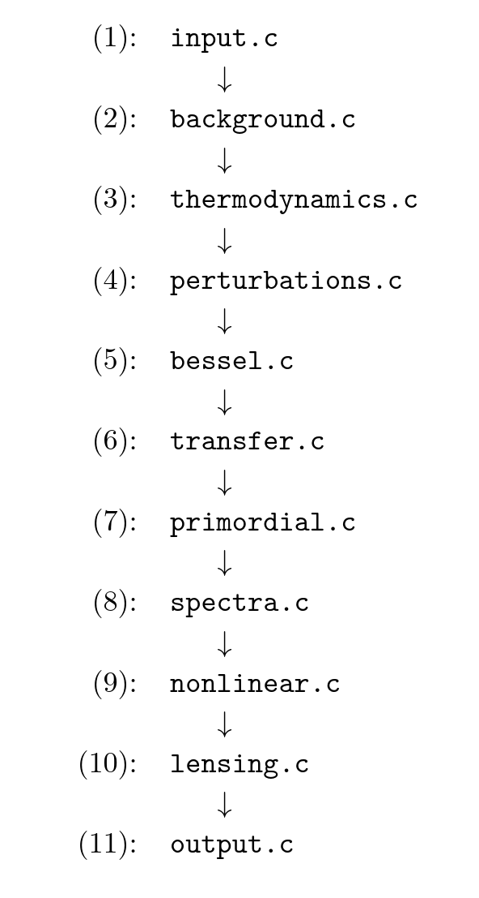
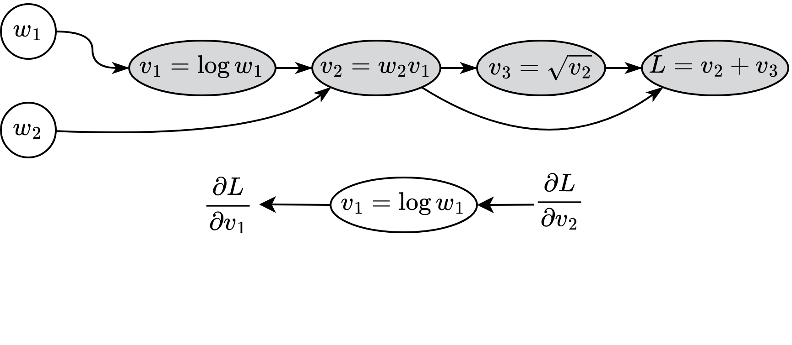
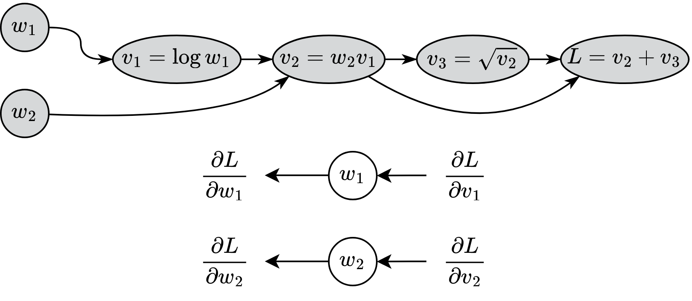

---

# Outline

1. Cosmology today

2. Boltzmann solvers

3. New features in SymBoltz.jl

   1. Symbolic modularity

   2. Approximation-free

   3. Differentiable

4. Synergy between new features

5. Current state and future plans

# Cosmology is at a crossroads

{height=75%}

# ΛCDM model

\centering
\begin{tikzpicture}[
   font=\scriptsize,
   comp/.style = {draw, circle, fill=gray, minimum size = 2.0cm, align=center},
   grow cyclic,
   level 1/.append style = {level distance = 3.3cm, sibling angle = 60},
   interaction/.style = {latex-latex, thick},
]
\node[comp] (grav) {General\\relativity} [interaction]
child { node[comp] (bar) {Baryons}}
child { node[comp] (pho) {Photons}}
child { node[comp] (neu) {Massless\\neutrinos}}
child { node[comp] (mneu) {Massive\\neutrinos}}
child { node[comp] (cdm) {Cold dark\\matter}}
child { node[comp] (cc) {Cosmological\\constant}};
\draw[interaction] (bar) -- node[above=, sloped, align=center] {Thomson\\scattering} (pho);
\end{tikzpicture}

# Challenges with the ΛCDM model

:::::::::::::: {.columns align=center}
::: {.column width="65%"}

- [$H₀$ tension](https://arxiv.org/abs/2105.05208)

 

- [$S₈$ tension](https://arxiv.org/abs/2105.05208)

 

- [$Λ$ problem](https://arxiv.org/abs/2105.05208)

 

- [Anisotropically distributed quasars](https://arxiv.org/abs/2009.14826)

 

- [Too massive early galaxies (JWST)](https://arxiv.org/abs/2309.13100)

 

- [Excess ISW signal from supervoids](https://arxiv.org/abs/1811.07812) 

 

- [DESI favors dynamical dark energy](https://arxiv.org/abs/2404.03002)

 

- ...

:::
::: {.column width="35%"}

](media/H0_tension.png)

](media/desi_de.png)

:::
::::::::::::::

# Alternative models are being explored

).](media/vote_edited.png){width=95%}

# Alternative models are being explored: e.g. modified gravity

[{width=95%}](https://www.tessabaker.space/images/map_slide_v2.pdf)

# Models are tested with Boltzmann solvers

[](https://www.reddit.com/r/photoshopbattles/comments/cfxzzg/battle_366_bigger_splash_via_previous_winner/)

# What does an Einstein-Boltzmann do? {.allowframebreaks}

\scriptsize
1. Read input parameters $\Omega_{m0}$, $\Omega_{b0}$, $T_{\gamma 0}$, $N_\mathrm{eff}$, $A_s$, $n_s$, $\ldots$

\scriptsize

2. Solve background ODEs:
   $$\tiny
   \begin{gathered}
   \left(\frac{\mathrm{d}a}{\mathrm{d}\tau}\right)^2 = \frac{8\pi}{3} \rho a^4, \quad
   \frac{\mathrm{d}^2 a}{\mathrm{d}\tau^2} = \frac{1}{a} \left(\frac{\mathrm{d}a}{\mathrm{d}\tau}\right)^2 - \frac{4\pi}{3} (\rho + 3P) a^3, \quad
   \frac{\mathrm{d}{ρ}_s}{\mathrm{d}\tau} = -3 ℋ (ρ_s + P_s), \quad
   P_s = w_s \rho_s
   \end{gathered}
   $$
\scriptsize

3. Solve thermodynamics ODEs:
   $$\tiny
   \begin{gathered}
   \frac{\mathrm{d}x_H}{\mathrm{d}\tau} = a C \left [\beta(T_b) (1-x_H) - n_H \alpha^{(2)}(T_b) x_H^2 \right], \quad
   \ldots
   \end{gathered}
   $$
\scriptsize

4. Solve perturbation ODEs:
   $$\tiny
   \begin{gathered}
   \frac{\mathrm{d}Φ}{\mathrm{d}\tau} = -\frac{4\pi}{3} a^2 ℋ \delta\rho - \frac{k^2}{3 ℋ} Φ - ℋ Ψ, \quad Φ - Ψ = \frac{12\pi a^2 Π}{k^2}, \\
   \frac{\mathrm{d} δ_s}{\mathrm{d}\tau} = -\Big(1+w_s\Big) \Big(θ_s-3\frac{\mathrm{d}Φ}{\mathrm{d}\tau}\Big) - 3 ℋ (cₛ²-w_s)δ_s, \quad
   \frac{\mathrm{d}θ_s}{\mathrm{d}\tau} = -ℋ(1-3w_s)θ_s + \frac{cₛ² k^2 δ_s}{1+w_s} + k^2 Ψ + \ldots
   \end{gathered}
   $$
\scriptsize

5. Solve line-of-sight ODEs
   $$\tiny
   \begin{gathered}
   \frac{\mathrm{d}\Theta_l}{\mathrm{d}\tau} = \left[ g \left( Θ₀+Ψ+\frac{Π}{4} \right) + \frac{g u_b}{k} + e^{-τ} \frac{\mathrm{d}}{\mathrm{d}\tau}(Ψ-Φ) + \frac{3}{4 k^2} \frac{\mathrm{d}^2}{\mathrm{d}\tau^2} (gΠ) \right] j_l\big((k (\tau_0-\tau)\big)
   \end{gathered}
   $$
\scriptsize

6. Output some function of the unknowns (observables), like $P(k)$ or $C_l$.

\framebreak

[](https://hersle.github.io/SymBoltz.jl/dev/getting_started/)

# History of Boltzmann solvers

\scriptsize

**Year**              **Code**                                                                                             **Lang.**  **New features**                                   
--------------------- ---------------------------------------------------------------------------------------------------- ---------- ------------------------------------------------- ------
1995                  [COSMICS](https://arxiv.org/abs/astro-ph/9506072) [ ](https://arxiv.org/pdf/astro-ph/9506070)        Fortran    First proper treatment; seminal paper             \emoji{headstone}
1996                  [CMBFAST](https://arxiv.org/abs/astro-ph/9603033)                                                    Fortran    Line-of-sight integration (lower $l_\text{max}$)  \emoji{headstone}
2000                  [CAMB](https://arxiv.org/abs/astro-ph/9911177)                                                       Fortran    Further development, closed models                \emoji{sports-medal}
2003                  [CMBEASY](https://arxiv.org/abs/astro-ph/0302138)                                                    C++        Code structure, object-oriented                   \emoji{headstone}
2011                  [CLASS](https://arxiv.org/abs/1104.2932)                                                             C          User-friendliness, flexibility, accuracy control  \emoji{sports-medal}
2017                  [PyCosmo](https://arxiv.org/abs/1708.05177)                                                          Py/C++     Symbolics, C++ code gen., sparsity optim.         \emoji{hatching-chick}
2021                  [Bolt](https://github.com/xzackli/Bolt.jl/)                                                          Julia      Differentiable, approx.-free?                     \emoji{hatching-chick}
2024                  [DISCO-EB](https://arxiv.org/abs/2311.03291)                                                         Py/Jax     Differentiable, approx.-free?                     \emoji{hatching-chick}
2025                  [SymBoltz](https://github.com/hersle/SymBoltz.jl)?                                                   Julia      Symbolic modularity, approx.-free, differentiable \emoji{hatching-chick}

... and all forks thereof; e.g. [EFTCAMB](https://arxiv.org/abs/1312.5742), [HiCLASS](https://arxiv.org/abs/1909.01828), ...

# Feature 1: symbolic modularity

- \small Build full model from partial submodels:

\tiny
```
julia> M = ΛCDM(); hierarchy(M)
ΛCDM: Standard cosmological constant and cold dark matter cosmological model
├─ g: Spacetime FLRW metric in Newtonian gauge
├─ G: General relativity gravity
├─ γ: Photon radiation
├─ ν: Massless neutrinos
├─ c: Cold dark matter
├─ b: Baryonic matter
│  └─ rec: Baryon-photon recombination thermodynamics (RECFAST)
├─ h: Massive neutrino
└─ Λ: Cosmological constant
```

- \small Represent all equations symbolically:

\tiny
```
julia> equations(M.G)
4-element Vector{Symbolics.Equation}:
 Differential(t)(a(t)) ~ sqrt((8//3)*ρ(t)*(a(t)^4)*π)
 Δ(t) ~ Differential(t)(Differential(t)(a(t))) + (-(Differential(t)(a(t))^2)*(1 + (-3P(t)) / ρ(t))) / (2a(t))
 Differential(t)(Φ(t))*ϵ ~ ((-(k^2)*Φ(t)) / (3ℰ(t)) + ((-4//3)*δρ(t)*(a(t)^2)*π) / ℰ(t) - ℰ(t)*Ψ(t))*ϵ
 (k^2)*(-Ψ(t) + Φ(t))*ϵ ~ 12Π(t)*(a(t)^2)*π*ϵ
```

- \small Give equations to a modeling library that generates fast code.

# Example: add $w₀wₐ$ dark energy: SymBoltz vs. CLASS

Governing equations:

$$
\begin{aligned}
w &= \frac{P}{\rho} = w_0 + w_a (1-a), \\
\frac{\mathrm{d}\rho}{\mathrm{d}\tau} &= -3 ℋ (\rho+P) \quad \rightarrow \quad \rho = ρ₀ a^{-3 (1 + w_0 + w_a)} e^{-3 w_a (1-a)}, \\
\frac{\mathrm{d}\delta}{\mathrm{d}\tau} &= -\Big(1+w\Big)\Big(\theta-3\frac{\mathrm{d}\Phi}{\mathrm{d}\tau}\Big) - 3 ℋ (c_s^2 - w) \delta, \\
\frac{\mathrm{d}\theta}{\mathrm{d}\tau} &= -ℋ (1-3w)\theta - \frac{\frac{\mathrm{d}w}{\mathrm{d}\tau}}{1+w}\theta + \frac{c_s^2}{1+w} k^2 \delta - k^2 \sigma + k^2 \Psi, \\
\sigma &= 0 \\
\end{aligned}
$$

# Example: add $w₀wₐ$ dark energy: SymBoltz

- Everything related to one species should be in one place:

\tiny

```julia
using SymBoltz, ModelingToolkit
using SymBoltz: t, k, ϵ, O, D

# 1) Create w₀wₐ dark energy component
g = SymBoltz.metric()
pars = @parameters w₀ wₐ ρ₀ Ω₀ cₛ²
vars = @variables ρ(t) P(t) w(t) δ(t) θ(t) σ(t)
eqs = [
    O(ϵ^0)(w ~ w₀ + wₐ * (1 - g.a))
    O(ϵ^0)(ρ ~ ρ₀ * g.a^(-3 * (1 + w₀ + wₐ)) * exp(-3 * wₐ * (1 - g.a)))
    O(ϵ^0)(P ~ w * ρ)
    O(ϵ^1)(D(δ) ~ -(1 + w) * (θ - 3*D(g.Φ)) - 3 * g.ℰ * (cₛ² - w) * δ)
    O(ϵ^1)(D(θ) ~ -g.ℰ * (1 - 3*w) - D(w) / (1 + w) * θ + cₛ² / (1 + w) * k^2 * δ - k^2 * σ + k^2 * g.Ψ)
    O(ϵ^1)(σ ~ 0)
]
initialization_eqs = [
    O(ϵ^1)(δ ~ -3/2 * (1+w) * g.Ψ)
    O(ϵ^1)(θ ~ 1/2 * (k^2*t) * g.Ψ)
]
defaults = [
    ρ₀ => 3/8π * Ω₀
]
@named X = ODESystem(eqs, t, vars, pars; initialization_eqs, defaults)

# 2) Create extended model and solve it
M = ΛCDM(Λ = X; name = :w₀wₐCDM, Λanalytical = true)
pars = merge(parameters_Planck18(M), Dict(M.X.w₀ => -1.0, M.X.wₐ => 0.0, M.X.cₛ² => 1.0))
sol = solve(M, pars)
```


# Example: add $w₀wₐ$ dark energy: CLASS {.allowframebreaks}

\footnotesize
[Official advice](https://lesgourg.github.io/class-tour/Padova/CLASS_Padova_Coding.pdf): `grep -Rn _fld include/ source/ python/`

1. Read input parameters and handle parameter dependencies:

\tiny
```
source/input.c:3177:  class_call(parser_read_double(pfc,"Omega_fld",&param2,&flag2,errmsg),
source/input.c:3186:             "'Omega_Lambda' or 'Omega_fld' must be left unspecified, except if 'Omega_scf' is set and < 0.");
source/input.c:3189:             "You have entered 'Omega_scf' < 0 , so you have to specify both 'Omega_lambda' and 'Omega_fld'.");
source/input.c:3215:    pba->Omega0_fld = param2;
source/input.c:3216:    Omega_tot += pba->Omega0_fld;
source/input.c:3232:    pba->Omega0_fld = 1. - pba->Omega0_k - Omega_tot;
source/input.c:3234:      printf(" -> matched budget equations by adjusting Omega_fld = %g\n",pba->Omega0_fld);
source/input.c:3248:  if (pba->Omega0_fld != 0.) {
source/input.c:3285:      class_read_double("w0_fld",pba->w0_fld);
source/input.c:3286:      class_read_double("wa_fld",pba->wa_fld);
source/input.c:3287:      class_read_double("cs2_fld",pba->cs2_fld);
source/input.c:3292:      class_read_double("w0_fld",pba->w0_fld);
source/input.c:3294:      class_read_double("cs2_fld",pba->cs2_fld);
```

\footnotesize
2. Add parameter hooks to Python wrapper, too:

\tiny
```
python/cclassy.pxd:91:        double Omega0_fld
python/cclassy.pxd:92:        double w0_fld
python/cclassy.pxd:93:        double wa_fld
python/cclassy.pxd:94:        double cs2_fld
```

\framebreak

\footnotesize
3. Declare background variables and indices

\tiny
```
include/background.h:104:  double Omega0_fld;       /**< \f$ \Omega_{0 de} \f$: fluid */
include/background.h:110:  double w0_fld;   /**< \f$ w0_{DE} \f$: current fluid equation of state parameter */
include/background.h:111:  double wa_fld;   /**< \f$ wa_{DE} \f$: fluid equation of state parameter derivative */
include/background.h:112:  double cs2_fld;  /**< \f$ c^2_{s~DE} \f$: sound speed of the fluid in the frame comoving with the fluid (so, this is
include/background.h:169:  int index_bg_rho_fld;       /**< fluid density */
include/background.h:170:  int index_bg_w_fld;         /**< fluid equation of state */
include/background.h:257:  int index_bi_rho_fld; /**< {B} fluid density */
include/background.h:289:  short has_fld;       /**< presence of fluid with constant w and cs2? */
include/background.h:416:  int background_w_fld(
include/background.h:419:                       double * w_fld,
include/background.h:420:                       double * dw_over_da_fld,
include/background.h:421:                       double * integral_fld);
```

\footnotesize
4. Compute background

\tiny
```
source/background.c:398:  double w_fld, dw_over_da, integral_fld;
source/background.c:540:  if (pba->has_fld == _TRUE_) {
source/background.c:542:    /* get rho_fld from vector of integrated variables */
source/background.c:543:    pvecback[pba->index_bg_rho_fld] = pvecback_B[pba->index_bi_rho_fld];
source/background.c:545:    /* get w_fld from dedicated function */
source/background.c:546:    class_call(background_w_fld(pba,a,&w_fld,&dw_over_da,&integral_fld), pba->error_message, pba->error_message);
source/background.c:547:    pvecback[pba->index_bg_w_fld] = w_fld;
source/background.c:550:    // pvecback[pba->index_bg_rho_fld] = pba->Omega0_fld * pow(pba->H0,2) / pow(a,3.*(1.+pba->w0_fld+pba->wa_fld)) * exp(3.*pba->wa_fld*(a-1.));
source/background.c:551:    // But now everthing is integrated numerically for a given w_fld(a) defined in the function background_w_fld.
source/background.c:553:    rho_tot += pvecback[pba->index_bg_rho_fld];
source/background.c:554:    p_tot += w_fld * pvecback[pba->index_bg_rho_fld];
source/background.c:555:    dp_dloga += (a*dw_over_da-3*(1+w_fld)*w_fld)*pvecback[pba->index_bg_rho_fld];
source/background.c:664:int background_w_fld(
source/background.c:667:                     double * w_fld,
source/background.c:668:                     double * dw_over_da_fld,
source/background.c:669:                     double * integral_fld
source/background.c:680:    *w_fld = pba->w0_fld + pba->wa_fld * (1. - a);
source/background.c:715:    *dw_over_da_fld = - pba->wa_fld;
source/background.c:738:    *integral_fld = 3.*((1.+pba->w0_fld+pba->wa_fld)*log(1./a) + pba->wa_fld*(a-1.));
source/background.c:985:  pba->has_fld = _FALSE_;
source/background.c:1012:  if (pba->Omega0_fld != 0.)
source/background.c:1013:    pba->has_fld = _TRUE_;
source/background.c:1080:  class_define_index(pba->index_bg_rho_fld,pba->has_fld,index_bg,1);
source/background.c:1081:  class_define_index(pba->index_bg_w_fld,pba->has_fld,index_bg,1);
source/background.c:1166:  class_define_index(pba->index_bi_rho_fld,pba->has_fld,index_bi,1);
source/background.c:1744:  double w_fld, dw_over_da, integral_fld;
source/background.c:1778:  if (pba->has_fld == _TRUE_) {
source/background.c:1780:    class_call(background_w_fld(pba,0.,&w_fld,&dw_over_da,&integral_fld), pba->error_message, pba->error_message);
source/background.c:1782:    class_test(w_fld >= 1./3.,
source/background.c:1785:               w_fld);
source/background.c:2150:  double rho_fld_today;
source/background.c:2151:  double w_fld,dw_over_da_fld,integral_fld;
source/background.c:2240:  if (pba->has_fld == _TRUE_) {
source/background.c:2242:    /* rho_fld today */
source/background.c:2243:    rho_fld_today = pba->Omega0_fld * pow(pba->H0,2);
source/background.c:2245:    /* integrate rho_fld(a) from a_ini to a_0, to get rho_fld(a_ini) given rho_fld(a0) */
source/background.c:2246:    class_call(background_w_fld(pba,a,&w_fld,&dw_over_da_fld,&integral_fld), pba->error_message, pba->error_message);
source/background.c:2254:    /* rho_fld at initial time */
source/background.c:2255:    pvecback_integration[pba->index_bi_rho_fld] = rho_fld_today * exp(integral_fld);
source/background.c:2453:  class_store_columntitle(titles,"(.)rho_fld",pba->has_fld);
source/background.c:2454:  class_store_columntitle(titles,"(.)w_fld",pba->has_fld);
source/background.c:2526:    class_store_double(dataptr,pvecback[pba->index_bg_rho_fld],pba->has_fld,storeidx);
source/background.c:2527:    class_store_double(dataptr,pvecback[pba->index_bg_w_fld],pba->has_fld,storeidx);
source/background.c:2652:  if (pba->has_fld == _TRUE_) {
source/background.c:2654:    dy[pba->index_bi_rho_fld] = -3.*(1.+pvecback[pba->index_bg_w_fld])*y[pba->index_bi_rho_fld];
```

\footnotesize
5. Declare perturbation variables

\tiny
```
include/perturbations.h:247:  short has_source_delta_fld;  /**< do we need source for delta of dark energy? */
include/perturbations.h:261:  short has_source_theta_fld;  /**< do we need source for theta of dark energy? */
include/perturbations.h:294:  int index_tp_delta_fld;  /**< index value for delta of dark energy */
include/perturbations.h:310:  int index_tp_theta_fld;   /**< index value for theta of dark energy */
include/perturbations.h:478:  int index_pt_delta_fld;  /**< dark energy density in true fluid case */
include/perturbations.h:479:  int index_pt_theta_fld;  /**< dark energy velocity in true fluid case */
```

\footnotesize
6. Compute perturbations

\tiny
```
source/perturbations.c:472:          class_store_double(dataptr,tk[ppt->index_tp_delta_fld],ppt->has_source_delta_fld,storeidx);
source/perturbations.c:501:          class_store_double(dataptr,tk[ppt->index_tp_theta_fld],ppt->has_source_theta_fld,storeidx);
source/perturbations.c:560:      class_store_columntitle(titles,"d_fld",pba->has_fld);
source/perturbations.c:589:      class_store_columntitle(titles,"t_fld",pba->has_fld);
source/perturbations.c:712:  double w_fld_ini, w_fld_0,dw_over_da_fld,integral_fld;
source/perturbations.c:1187:  ppt->has_source_delta_fld = _FALSE_;
source/perturbations.c:1202:  ppt->has_source_theta_fld = _FALSE_;
source/perturbations.c:1294:        if (pba->has_fld == _TRUE_)
source/perturbations.c:1295:          ppt->has_source_delta_fld = _TRUE_;
source/perturbations.c:1325:        if (pba->has_fld == _TRUE_)
source/perturbations.c:1326:          ppt->has_source_theta_fld = _TRUE_;
source/perturbations.c:1401:      class_define_index(ppt->index_tp_delta_fld,  ppt->has_source_delta_fld, index_type,1);
source/perturbations.c:1415:      class_define_index(ppt->index_tp_theta_fld,  ppt->has_source_theta_fld, index_type,1);
source/perturbations.c:3360:      class_store_columntitle(ppt->scalar_titles, "delta_rho_fld", pba->has_fld);
source/perturbations.c:3361:      class_store_columntitle(ppt->scalar_titles, "rho_plus_p_theta_fld", pba->has_fld);
source/perturbations.c:3362:      class_store_columntitle(ppt->scalar_titles, "delta_p_fld", pba->has_fld);
source/perturbations.c:3941:      class_define_index(ppv->index_pt_delta_fld,pba->has_fld,index_pt,1); /* fluid density */
source/perturbations.c:3942:      class_define_index(ppv->index_pt_theta_fld,pba->has_fld,index_pt,1); /* fluid velocity */
source/perturbations.c:4402:      if (pba->has_fld == _TRUE_) {
source/perturbations.c:4405:          ppv->y[ppv->index_pt_delta_fld] =
source/perturbations.c:4406:            ppw->pv->y[ppw->pv->index_pt_delta_fld];
source/perturbations.c:4408:          ppv->y[ppv->index_pt_theta_fld] =
source/perturbations.c:4409:            ppw->pv->y[ppw->pv->index_pt_theta_fld];
source/perturbations.c:5281:  double w_fld,dw_over_da_fld,integral_fld;
source/perturbations.c:5458:      if (pba->has_fld == _TRUE_) {
source/perturbations.c:5460:        class_call(background_w_fld(pba,a,&w_fld,&dw_over_da_fld,&integral_fld), pba->error_message, ppt->error_message);
source/perturbations.c:5463:          ppw->pv->y[ppw->pv->index_pt_delta_fld] = - ktau_two/4.*(1.+w_fld)*(4.-3.*pba->cs2_fld)/(4.-6.*w_fld+3.*pba->cs2_fld) * ppr->curvature_ini * s2_squared; /* from 1004.5509 */ //TBC: curvature
source/perturbations.c:5465:          ppw->pv->y[ppw->pv->index_pt_theta_fld] = - k*ktau_three/4.*pba->cs2_fld/(4.-6.*w_fld+3.*pba->cs2_fld) * ppr->curvature_ini * s2_squared; /* from 1004.5509 */ //TBC:curvature
source/perturbations.c:5740:      if ((pba->has_fld == _TRUE_) && (pba->use_ppf == _FALSE_)) {
source/perturbations.c:5742:        class_call(background_w_fld(pba,a,&w_fld,&dw_over_da_fld,&integral_fld), pba->error_message, ppt->error_message);
source/perturbations.c:5744:        ppw->pv->y[ppw->pv->index_pt_delta_fld] -= 3*(1.+w_fld)*a_prime_over_a*alpha;
source/perturbations.c:5745:        ppw->pv->y[ppw->pv->index_pt_theta_fld] += k*k*alpha;
source/perturbations.c:6719:  double w_fld,dw_over_da_fld,integral_fld;
source/perturbations.c:6727:  double w_prime_fld, ca2_fld;
source/perturbations.c:6730:  double rho_fld, p_fld, rho_fld_prime, p_fld_prime;
source/perturbations.c:6732:  double Gamma_fld, S, S_prime, theta_t, theta_t_prime, rho_plus_p_theta_fld_prime;
source/perturbations.c:7109:    if (pba->has_fld == _TRUE_) {
source/perturbations.c:7111:      class_call(background_w_fld(pba,a,&w_fld,&dw_over_da_fld,&integral_fld), pba->error_message, ppt->error_message);
source/perturbations.c:7112:      w_prime_fld = dw_over_da_fld * a_prime_over_a * a;
source/perturbations.c:7115:        ppw->delta_rho_fld = ppw->pvecback[pba->index_bg_rho_fld]*y[ppw->pv->index_pt_delta_fld];
source/perturbations.c:7116:        ppw->rho_plus_p_theta_fld = (1.+w_fld)*ppw->pvecback[pba->index_bg_rho_fld]*y[ppw->pv->index_pt_theta_fld];
source/perturbations.c:7117:        ca2_fld = w_fld - w_prime_fld / 3. / (1.+w_fld) / a_prime_over_a;
source/perturbations.c:7119:        ppw->delta_p_fld = pba->cs2_fld * ppw->delta_rho_fld + (pba->cs2_fld-ca2_fld)*(3*a_prime_over_a*ppw->rho_plus_p_theta_fld/k/k);
source/perturbations.c:7387:  double w_fld,dw_over_da_fld,integral_fld;
source/perturbations.c:7787:    /* delta_fld */
source/perturbations.c:7788:    if (ppt->has_source_delta_fld == _TRUE_) {
source/perturbations.c:7789:      _set_source_(ppt->index_tp_delta_fld) = ppw->delta_rho_fld/pvecback[pba->index_bg_rho_fld]
source/perturbations.c:7790:        + 3.*a_prime_over_a*(1.+pvecback[pba->index_bg_w_fld])*theta_over_k2; // N-body gauge correction
source/perturbations.c:7903:    /* theta_fld */
source/perturbations.c:7904:    if (ppt->has_source_theta_fld == _TRUE_) {
source/perturbations.c:7906:      class_call(background_w_fld(pba,a,&w_fld,&dw_over_da_fld,&integral_fld), pba->error_message, ppt->error_message);
source/perturbations.c:7908:      _set_source_(ppt->index_tp_theta_fld) = ppw->rho_plus_p_theta_fld/(1.+w_fld)/pvecback[pba->index_bg_rho_fld]
source/perturbations.c:8472:    class_store_double(dataptr, ppw->delta_rho_fld, pba->has_fld, storeidx);
source/perturbations.c:8473:    class_store_double(dataptr, ppw->rho_plus_p_theta_fld, pba->has_fld, storeidx);
source/perturbations.c:8474:    class_store_double(dataptr, ppw->delta_p_fld, pba->has_fld, storeidx);
source/perturbations.c:8683:  double w_fld,dw_over_da_fld,w_prime_fld,integral_fld;
source/perturbations.c:9269:    if (pba->has_fld == _TRUE_) {
source/perturbations.c:9276:        class_call(background_w_fld(pba,a,&w_fld,&dw_over_da_fld,&integral_fld), pba->error_message, ppt->error_message);
source/perturbations.c:9277:        w_prime_fld = dw_over_da_fld * a_prime_over_a * a;
source/perturbations.c:9279:        ca2 = w_fld - w_prime_fld / 3. / (1.+w_fld) / a_prime_over_a;
source/perturbations.c:9280:        cs2 = pba->cs2_fld;
source/perturbations.c:9284:        dy[pv->index_pt_delta_fld] =
source/perturbations.c:9285:          -(1+w_fld)*(y[pv->index_pt_theta_fld]+metric_continuity)
source/perturbations.c:9286:          -3.*(cs2-w_fld)*a_prime_over_a*y[pv->index_pt_delta_fld]
source/perturbations.c:9287:          -9.*(1+w_fld)*(cs2-ca2)*a_prime_over_a*a_prime_over_a*y[pv->index_pt_theta_fld]/k2;
source/perturbations.c:9291:        dy[pv->index_pt_theta_fld] = /* fluid velocity */
source/perturbations.c:9292:          -(1.-3.*cs2)*a_prime_over_a*y[pv->index_pt_theta_fld]
source/perturbations.c:9293:          +cs2*k2/(1.+w_fld)*y[pv->index_pt_delta_fld]
```

\footnotesize

- I left out *many* lines

- Fortunately, this model did not need thermodynamics modifications

- A lot of boilerplate!


# Architecture: CLASS vs. SymBoltz {.allowframebreaks}

\small

:::::::::::::: {.columns}
::: {.column width="50%"}
{height=4.2cm}

\emoji{red-square} Structure is overwhelming

\emoji{red-square} Extensions encourage duplication

\emoji{green-square} Full freedom

:::
::: {.column width="50%"}
{height=4.2cm}

\emoji{green-square} Structure is clearly separated

\emoji{green-square} Extensions encourage modularity

\emoji{red-square} More constrained

:::
::::::::::::::

\framebreak

:::::::::::::: {.columns}
::: {.column width="50%"}

{height=50%}

\emoji{red-square} Friendly towards programmers

\emoji{red-square} Scales worse in model space

\emoji{green-square} Easier to follow?

:::
::: {.column width="50%"}

\begin{figure}
\scalebox{0.55}{
\begin{tikzpicture}[
   font=\scriptsize,
   comp/.style = {draw, circle, fill=gray, minimum size = 2.0cm, align=center},
   grow cyclic,
   level 1/.append style = {level distance = 3.3cm, sibling angle = 60},
   interaction/.style = {latex-latex, thick},
]
\node[comp] (grav) {Gravity} [interaction]
child { node[comp] (bar) {Baryons}}
child { node[comp] (pho) {Photons}}
child { node[comp] (neu) {Massless\\neutrinos}}
child { node[comp] (mneu) {Massive\\neutrinos}}
child { node[comp] (cdm) {Cold dark\\matter}}
child { node[comp] (cc) {Cosmological\\constant}};
\draw[interaction] (bar) -- node[above=, sloped, align=center] {Thomson\\scattering} (pho);
\end{tikzpicture}
}
\caption{SymBoltz is structured physically}
\end{figure}

\emoji{green-square} Friendly towards modelers

\emoji{green-square} Scales better in model space

\emoji{red-square} Harder to debug?

:::
::::::::::::::


# Benefits from using a modeling library

[ModelingToolkit.jl](https://github.com/SciML/ModelingToolkit.jl) can automatically ...

- generate performant numerical code

- index ODE variables

- reduce ODE order to 1 (e.g. $\mathrm{d^2}a/\mathrm{d}\tau^2 = \ldots$)

- validate consistency and units of equations

- lazily compute observeds from unknowns (e.g. $\Psi$ from $\Phi$)

- calculate Jacobian and find its sparsity pattern

- transform equations to more stable forms

- parallellize independent equations (GPUs?)

- display model equations

**Goal:** modeler should be able to just write down all equations!


# ModelingToolkit.jl: symbolic-numeric modeling language

{width=49%}
{width=49%}

Still maturing; I have contributed quite a bit.


# Feature 2: approximation-free stiffness treatment

```{=latex}
\begin{center}
```
{width=60%}
```{=latex}
\end{center}
```

\small

Stiffness often occurs with multiple \textcolor{red}{(inverse) time scales}, e.g.:
$$\frac{\mathrm{d} θ_b}{\mathrm{d}t} = -\textcolor{red}{ℋ} θ_b + \textcolor{red}{k^2} cₛ² δ_b - \textcolor{red}{\tau^{-1}} \frac{4ρ_γ}{3ρᵦ} (θ_γ - θ_b)$$

Two cures:

1. Explicit integrators with approximate non-stiff equations
2. Implicit integrators with full stiff equations

# Solution 1: explicit integrators with approximations

:::::::::::::: {.columns}
::: {.column width="61%"}
Remove stiffness with approximations for

- baryon-photon tight coupling (TCA),

- radiation streaming (RSA),

- ultra-relativistic fluid (UFA),

- same for massive neutrinos,

- same for interacting dark radiation,

- ...


:::
::: {.column width="39%"}
)](media/approximations.png){height=50%}
:::
::::::::::::::

**Myth:** approximations "[unavoidable](https://arxiv.org/pdf/1104.2932)"; stiff eqs. "[impossible](https://cosmologist.info/notes/CAMB.pdf)".

\emoji{green-square} Explicit and fewer equations $\implies$ fast

\emoji{red-square} Approximate, switching eqs. complicates physics and numerics

\emoji{red-square} Extensions reintroduce stiffness, scales poorly in model space

# Solution 2: implicit integrators without approximations

General Runge-Kutta method for ODE $\dot{y} = f(t, y)$ with $s$ stages:
$$\textstyle y_{n+1} = y_n + h \sum_{i=1}^s b_i k_i, \quad k_i = f(t_n + c_i h, y_n + \sum_{j=1}^s a_{ij} k_j)$$

- $A = [a_{ij}]$ lower triangular $\implies$ $\mathbf{k}$ given **explicitly**.

- $A = [a_{ij}]$ general: $\implies$ $\mathbf{k}$ given **implicitly** from $\mathbf{z}$ in
  $$\underbrace{\left[ I - (A \otimes I) J(\mathbf{z}_n) \right]}_\text{$sd \times sd$ matrix} \mathbf{z}_{n+1} = -\mathbf{z}_n + (A \otimes I) F(\mathbf{z}_n)$$
  - Need accurate $J_{ij} = \partial f_i / \partial y_j$ (auto. diff. > fin. diff.)
  - Reduce cost by LU factorizing and reusing $I - (A \otimes I) J(\mathbf{z}_n)$
  - Sparse matrix methods important for large systems!

\emoji{green-square} Accurate, no switching, clear physics, scales well in model space

\emoji{red-square} Slower (but fast enough? CLASS defaults to implicit method)

# DifferentialEquations.jl: "#1 differential equations library"

](media/de_comparison_cropped.pdf)

# Easily change ODE solver

SymBoltz can use [any DifferentialEquations.jl solver](https://docs.sciml.ai/DiffEqDocs/stable/solvers/ode_solve/) with 1 LOC:

```julia
solve(M, pars, k; solver = RK4())      # explicit, fails
solve(M, pars, k; solver = Tsit5())    # explicit, fails

solve(M, pars, k; solver = Rodas5P())  # implicit, works
solve(M, pars, k; solver = KenCarp4()) # implicit, works
solve(M, pars, k; solver = Kvaerno5()) # implicit, works
solve(M, pars, k; solver = QNDF())     # implicit, works
solve(M, pars, k; solver = QBDF())     # implicit, works
```

CLASS has only 2 hardcoded solvers:

   - RK4 (explicit)

   - NDF15 (implicit, default)

# Feature 3: differentiability {.allowframebreaks}

:::::::::::::: {.columns}
::: {.column width="50%"}

Derivatives are important in:

 

- **Optimization:** parameter inference, Monte Carlo methods (HMC, NUTS)

- **Machine learning:** training emulators (gradient descent)

- **Implicit ODE solvers:** stiff Boltzmann eqs.

- **Calculations:** forecasts

- **Sensitivity analysis:** $∂(\mathrm{output}) / ∂(\mathrm{input})$

:::
::: {.column width="50%"}

).](media/high_dimensional_inference.png){height=75%}

:::
::::::::::::::

\framebreak

\tiny
```julia
using ForwardDiff
lgP(lgθ) = log10.(P(ks, 10 .^ lgθ) / u"Mpc^3")
dlgP_dlgθs = ForwardDiff.jacobian(lgP, log10.(θ))
```

\normalsize

{height=60%}

# Method 1: manual differentiation

```
L(w₁,w₂) = w₂*log(w₁) + √(w₂*log(w₁))

∂L₁(w₁,w₂) = w₂/w₁ + (w₂/w₁) / (2*√(w₂*log(w₁)))
∂L₂(w₁,w₂) = log(w₁) + log(w₁) / (2*√(w₂))
∂L(w₁,w₂) = [∂L₁(w₁,w₂), ∂L₂(w₁,w₂)]


```

\emoji{green-square} Exact, fast

\emoji{red-square} Tedious, error-prone, no implicit expressions

# Method 2: symbolic differentiation

```
L(w₁,w₂) = w₂*log(w₁) + √(w₂*log(w₁))

using Symbolics # CAS package
function ∂L(w₁,w₂)
   @variables W₁ W₂
   ∂L₁ = expand_derivatives(Differential(W₁)(L(W₁,W₂)))
   ∂L₂ = expand_derivatives(Differential(W₂)(L(W₁,W₂)))
   return substitute([∂L₁, ∂L₂], Dict(W₁ => w₁, W₂ => w₂))
end
```

\emoji{green-square} Exact, fast evaluation

\emoji{red-square} Cumbersome setup, limited control flow, no implicit expressions


# Method 3: numerical differentiation (finite differences)

```
L(w₁,w₂) = w₂*log(w₁) + √(w₂*log(w₁))

∂L₁(w₁,w₂; ϵ=1e-5) = (L(w₁+ϵ/2,w₂) - L(w₁-ϵ/2,w₂)) / ϵ
∂L₂(w₁,w₂; ϵ=1e-5) = (L(w₁,w₂+ϵ/2) - L(w₁,w₂-ϵ/2)) / ϵ
∂L(w₁,w₂; ϵ=1e-5) = [∂L₁(w₁,w₂;ϵ), ∂L₂(w₁,w₂;ϵ)]


```

\emoji{green-square} Simple, reuses code

\emoji{red-square} Depends on $\epsilon$, unstable, time $\mathcal{O(n)}$ for $\nabla f(x_1,\ldots,x_n)$


# Method 4: automatic differentiation ("autodiff")

```
L(w₁,w₂) = w₂*log(w₁) + √(w₂*log(w₁))

using ForwardDiff
∂L(w₁,w₂) = ForwardDiff.gradient(L, [w₁,w₂])


```

\emoji{green-square} Fast, simple for user, reuses code, stable, no $\epsilon$, any function

\emoji{red-square} Needs full source code, difficult to implement efficiently

# Automatic differentiation: intuition

Any computer program is one (big) composite function $f(x) = f_n(f_{n-1}(\cdots f_2(f_1(x))))$ of elementary operations $f_i$.

- Let compiler transform code for $f(x)$ into code for $f\prime(x)$.

 

Chain rule on $f(x) = f_3(f_2(f_1(x)))$ can be traversed in two ways:

- $\displaystyle \frac{\partial f}{\partial x} = \frac{\partial f_3}{\partial f_2} \cdot \frac{\partial f_2}{\partial f_1} \cdot \frac{\partial f_1}{\partial x} \quad\rightarrow\quad \text{reverse-mode}$

- $\displaystyle \frac{\partial f}{\partial x} = \frac{\partial f_1}{\partial x} \cdot \frac{\partial f_2}{\partial f_1} \cdot \frac{\partial f_3}{\partial f_2} \quad\rightarrow\quad \text{forward-mode}$

# Automatic differentiation: forward-mode {.allowframebreaks}

[Example](https://fmin.xyz/docs/methods/Autograd.html):

{width=80%}

\framebreak
{width=80%}

- Values evaluated in forward pass

- Derivatives evaluated in forward pass

\framebreak
{width=80%}

- Values evaluated in forward pass

- Derivatives evaluated in forward pass

\framebreak
{width=80%}

- Values evaluated in forward pass

- Derivatives evaluated in forward pass

\framebreak
{width=80%}

- Values evaluated in forward pass

- Derivatives evaluated in forward pass

\framebreak
{width=80%}

- Values evaluated in forward pass

- Derivatives evaluated in forward pass

# Automatic differentiation: reverse-mode {.allowframebreaks}

[Same example](https://fmin.xyz/docs/methods/Autograd.html):

{width=80%}

\framebreak
{width=80%}

- Values evaluated in forward pass

- Derivatives evaluated in reverse pass

\framebreak
{width=80%}

- Values evaluated in forward pass

- Derivatives evaluated in reverse pass

\framebreak
{width=80%}

- Values evaluated in forward pass

- Derivatives evaluated in reverse pass

\framebreak
{width=80%}

- Values evaluated in forward pass

- Derivatives evaluated in reverse pass

\framebreak
{width=80%}

- Values evaluated in forward pass

- Derivatives evaluated in reverse pass


# Automatic differentiation: forward-mode vs. reverse-mode

Have function
$f: \mathbb{R}^m \rightarrow \mathbb{R}^n$.
Want Jacobian
$J = \partial f_i / \partial f_j$.

- Forward-mode: $m$ sweeps, faster when $m < n$ (more outputs)

- Reverse-mode: $n$ sweeps, faster when $m > n$ (more inputs)

[](https://fmin.xyz/docs/methods/Autograd.html)


# Automatic differentiation: implementation

\small

- **Source transformation:** equivalent to symbolic differentiation, limited control flow to information available at compile time.

- **Operator overloading:** new number types with derivative rules, stores value *and* derivative ("duals"/"adjoints").

- **Memory management:**

  - **Forward-mode:** Easy! Store additional derivative component.

  - **Reverse-mode:** Hard! Derivatives from backwards pass needs values from forward pass stored in memory ("tape").

{width=45%}

AD has turned into a new compiler/language design problem.

# Cheap gradient principle

:::::::::::::: {.columns}
::: {.column width="25%"}
[](https://epubs.siam.org/doi/abs/10.1137/1.9780898717761.ch4)
:::
::: {.column width="75%"}

:::
::::::::::::::

# Summary of differentiation methods

[](https://fmin.xyz/docs/methods/Autograd.html)

# New features

\begin{center}
% https://stackoverflow.com/a/56695563, https://tex.stackexchange.com/a/56591
\begin{tikzpicture}[
   pillar/.style={circle, draw, minimum size=2.5cm, align=center, font=\scriptsize},
   joiner/.style={midway, sloped, black, font=\scriptsize},
   arrow/.style={-latex, thick, red},
]
\node[pillar, fill=gray] (sym) at (0:0cm) {Easy\\symbolic\\modularity};
\node[pillar, fill=gray] (app) at (240:6cm) {Approximation-\\free};
\node[pillar, fill=gray] (dif) at (300:6cm) {Automatic\\differentiation};
\end{tikzpicture}
\end{center}

# New features are self-reinforcing

\begin{center}
% https://stackoverflow.com/a/56695563, https://tex.stackexchange.com/a/56591
\begin{tikzpicture}[
   pillar/.style={circle, draw, minimum size=2.5cm, align=center, font=\scriptsize},
   joiner/.style={midway, sloped, black, font=\scriptsize},
   arrow/.style={-latex, thick, red},
]
\node[pillar, fill=gray] (sym) at (0:0cm) {Easy\\symbolic\\modularity};
\node[pillar, fill=gray] (app) at (240:6cm) {Approximation-\\free};
\node[pillar, fill=gray] (dif) at (300:6cm) {Automatic\\differentiation};
\draw[arrow] (sym.305) -- node[joiner, above] {$J$ sparsity detection} (dif.115);
\draw[arrow] (sym.245) -- node[joiner, below] {Generate equations?} (app.55);
\draw[arrow] (dif.185) -- node[joiner, below] {Generate accurate $J$} (app.355);
\draw[arrow] (dif.125) -- node[joiner, below] {Model-agnostic shooting} (sym.295);
\draw[arrow] (app.65) -- node[joiner, above] {Easy to specify model} (sym.235);
\draw[arrow] (app.5) -- node[joiner, above] {No discontinuities} (dif.175);
\end{tikzpicture}
\end{center}

# Current state and future plans

\footnotesize

Initial                                          Future
------------------------------------------------ -------------------------------------
\emoji{green-square}  Baryons+photons (RECFAST)  \emoji{red-square} Non-linear: halo fit / $N$-body
\emoji{green-square}  Cold dark matter           \emoji{red-square} Symbolic tensor library ($G_{\mu\nu} = \ldots$)
\emoji{green-square}  Massless neutrinos         \emoji{red-square} Symbolic initial conditions
\emoji{yellow-square} Massive neutrinos          \emoji{red-square} Unit support
\emoji{green-square}  Cosmological constant      \emoji{red-square} Non-flat geometry
\emoji{yellow-square}  Quintessence              \emoji{red-square} GPU support
\emoji{green-square}  $w₀wₐ$ dark energy         \emoji{red-square} Interface with samplers?
\emoji{green-square}  General Relativity         \emoji{red-square} Better representation of interactions
\emoji{yellow-square}  Brans-Dicke gravity       \emoji{red-square} Reverse-mode autodiff
\emoji{green-square}  Symbolic modularity        \emoji{red-square} Specialized ODE autodiff
\emoji{green-square}  Approximation-free         
\emoji{green-square}  Differentiable
\emoji{green-square}  Matter power spectrum
\emoji{yellow-square} CMB power spectrum
\emoji{green-square}  Easy post processing
\emoji{yellow-square} Performance
\emoji{green-square}  Shooting method
\emoji{yellow-square} CI, documentation, ...
\emoji{yellow-square} Comparison with CLASS

# The end

{height=0.75em} Code & documentation: [github.com/hersle/SymBoltz.jl](https://github.com/hersle/SymBoltz.jl)](media/einstein_boltzmann.png)

# An Einstein-Boltzmann solver ...
... solves the (gravitational) Einstein equations
$$
%\underset{\underset{\mathllap{\text{spacetime geometry}}}{\uparrow}}{G_{\mu \nu}} = \frac{8 \pi G}{c^4} \underset{\underset{\mathrlap{\text{energy-momentum content}}}{\uparrow}}{T_{\mu \nu}}
\scriptsize{\textcolor{gray}{\text{geometry} \rightarrow \quad}} G_{\mu\nu} = \frac{8 \pi G}{c^4} T_{\mu\nu} \scriptsize{\textcolor{gray}{\quad \leftarrow \text{content}}}
$$
coupled to particle species, each described by Boltzmann equations
$$\left( p^\mu \frac{\partial}{\partial x^\mu} - \Gamma^\mu_{\alpha \beta} p^\alpha p^\beta \frac{\partial}{\partial p^\mu} \right) \underset{\textcolor{gray}{\underset{\mathclap{\text{distribution function}}}{\uparrow}}}{f_s} = C[f_s] \textcolor{gray}{\quad \leftarrow \text{interactions}}$$
to 1st perturbative order around a homo. and iso. FLRW spacetime
$$\mathrm{d}s^2 = a^2 (-1-2 \Psi) \mathrm{d}t^2 + a^2 (1 - 2 \Phi) \mathrm{d}\mathbf{x}^2$$
(with lots of pre- and post-processing).

# An Einstein-Boltzmann solver solves the ODEs ...

$$
\begin{aligned}
%\dot{\phantom{x}} &= \mathrm{d}/\mathrm{d} \tau, \\
\dot{a} &= \sqrt{\frac{8 \pi}{3} \rho} \, a^2, \\
\ddot{a} &= \frac{\dot{a}^2}{a} - \frac{4\pi}{3} (\rho + 3P) a^3, \\
\dot{Φ} &= -\frac{4\pi}{3} a^2 ℋ \delta\rho - \frac{k^2}{3 ℋ} Φ - ℋ Ψ, \\
k^2 (Φ - Ψ) &= 12\pi a^2 Π, \\
\dot{ρ}_s &= -3 ℋ (ρ_s + P_s), \\
P_s &= w_s \rho_s, \\
\dot{δ}_s &= -(1+w_s) (θ_s-3\dot{Φ}) - 3 ℰ (cₛ²-w_s)δ_s, \\
\dot{θ}_s &= -ℋ(1-3w_s)θ_s - \frac{\dot{w}_s θ_s}{1+w_s} + \frac{cₛ² k^2 δ_s}{1+w_s}  - k^2 σ_s + k^2 Ψ, \\
&\vdots
\end{aligned}
$$

---

# An Einstein-Boltzmann solver outputs e.g. ...

:::::::::::::: {.columns}
::: {.column width="50%"}
{height=3.5cm}
:::
::: {.column width="50%"}
{height=3.5cm}
:::
::::::::::::::

# Automatic differentiation: implementation II

- **Interception:** define a special function to compute one function's contribution to $J$ at any point in the call hierarchy (e.g. matrix methods, ODE solver, Newton's method, etc.).

  - Favors languages with *multiple dispatch* (e.g. Julia).

# Why start over in Julia?

- New symbolic modular architecture

- Differentiable programs need entire source code

- Want to contribute to cosmology environment in Julia

- Julia has excellent modeling, ODE and AD libraries!

# ForwardDiff.jl: forward mode automatic differentiation

# Miscellaneous

- [Standard reference for cosmological perturbations](https://arxiv.org/abs/astro-ph/9506072)

- [Why use ModelingToolkit.jl](https://discourse.julialang.org/t/what-are-the-advantages-of-using-modelingtoolkit-to-make-and-solve-odeproblems/103563)

- [Causal vs Acausal Modeling By Example: Why Julia ModelingToolkit.jl Scales](https://www.youtube.com/watch?v=ZYkojUozeC4)

- How to do equation-specific tweaks?

- *Why* re-implement everything from scratch, instead of building upon existing works?

- 2nd order code: [`song`](https://github.com/coccoinomane/song)

- CAMB has a "[symbolic toolkit notebook](https://camb.readthedocs.io/en/latest/ScalEqs.html)"

- [Lesgourges' CLASS presentations](https://lesgourg.github.io/courses.html): [content](https://lesgourg.github.io/class-tour/Padova/CLASS_Padova_Content.pdf), [coding](https://lesgourg.github.io/class-tour/Padova/CLASS_Padova_Coding.pdf), [exercises](https://lesgourg.github.io/class-tour/Padova/CLASS_Padova_Exercises.pdf)

- Bolt.jl talks: [2022](https://www.cosmologyfromhome.com/wp-content/uploads/2022/06/cfh2022_Sullivan_James.pdf), [2023](https://indico.cmb-s4.org/event/51/contributions/1359/subcontributions/137/attachments/1016/2543/CMBS4_23_Bolt.pdf), [2023](https://cosmologyfromhome.com/wp-content/uploads/2023/06/cfh2023-James-Sullivan.pdf)

- [CMB codes (CAMB, including symbolic module)](https://cosmologist.info/notes/Boltzmann_Nov21.pdf)


---

- [Implicit ODE solver source](https://www.epfl.ch/labs/anchp/wp-content/uploads/2018/05/part2-1.pdf)

- Chris Rackauckas' StackExchange answers [BDF vs implicit](https://scicomp.stackexchange.com/questions/27178/bdf-vs-implicit-runge-kutta-time-stepping) and [stiff solver time complexity](https://scicomp.stackexchange.com/questions/28617/comparing-algorithmic-complexity-ode-solvers-big-o?noredirect=1&lq=1)

- Search for [Creative Commons media](https://openverse.org/)

- [Hans' Boltzmann solver output](https://cmb.wintherscoming.no/calc.php)

- [Øyvind's presentation](https://www.mn.uio.no/fysikk/english/research/groups/theory/theory-seminars/2024_christiansen.pdf)

- [CLASS: "TCA could even be removed](https://lesgourg.github.io/class-tour/Padova/CLASS_Padova_Content.pdf#page=47)

- [Gradient accelerated cosmology](https://inspirehep.net/files/9f87e256e18469eebaffec47bc385028)

- [How nuisance parameters slows down inference](https://arxiv.org/abs/2301.11895)

# Miscellaneous

Definitions
$$
\begin{aligned}
u^\mu &= \ldots, \\
T^{\mu\nu} &= (\rho + P) u^\mu u^\nu + P g^{\mu\nu}, \\
G_{\mu\nu} &= \ldots,
\end{aligned}
$$

Equations of motion
$$
\begin{aligned}
G_{\mu\nu} &= 8 \pi T_{\mu\nu}, \\
\nabla_\mu (n u^\mu) &= 0, \\
\nabla_\mu T^{\mu\nu} &= 0, \\
\ldots
\end{aligned}
$$

Relativistic fluid mechanics on a manifold?

Handle interactions on symbolic level;
then generate efficient numerical functions.
