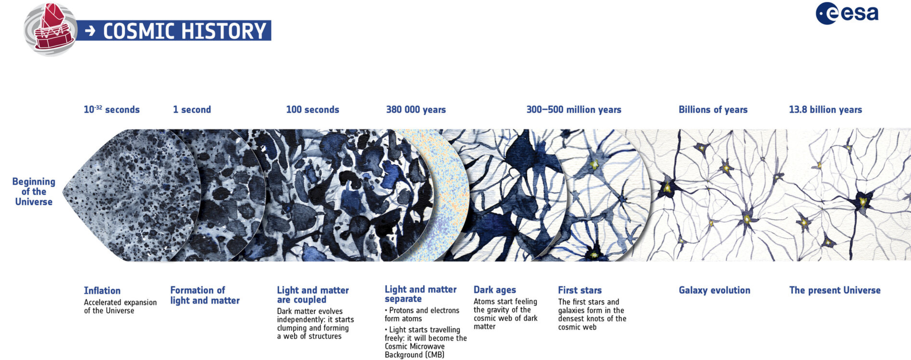
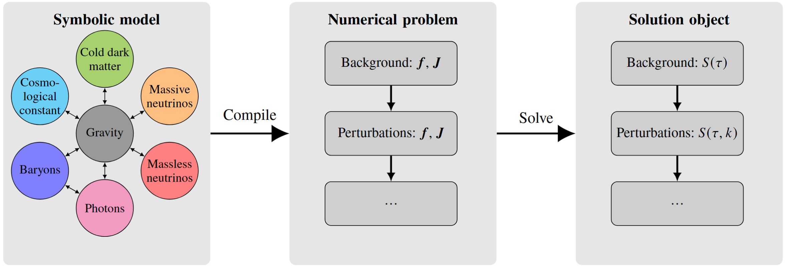
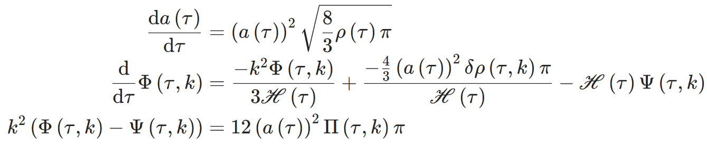
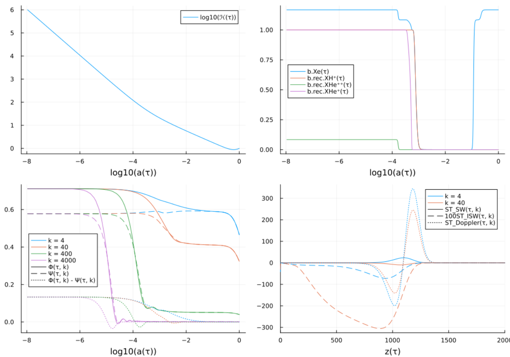
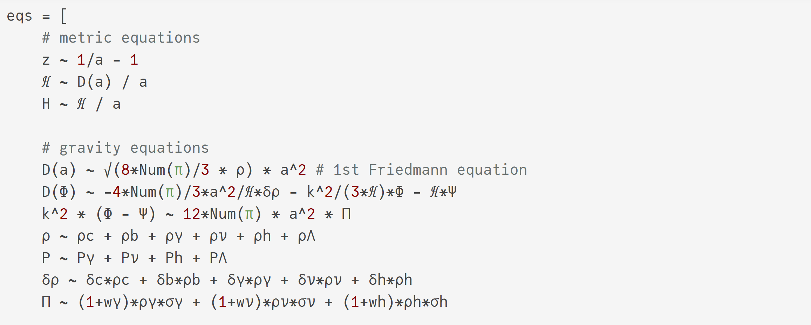
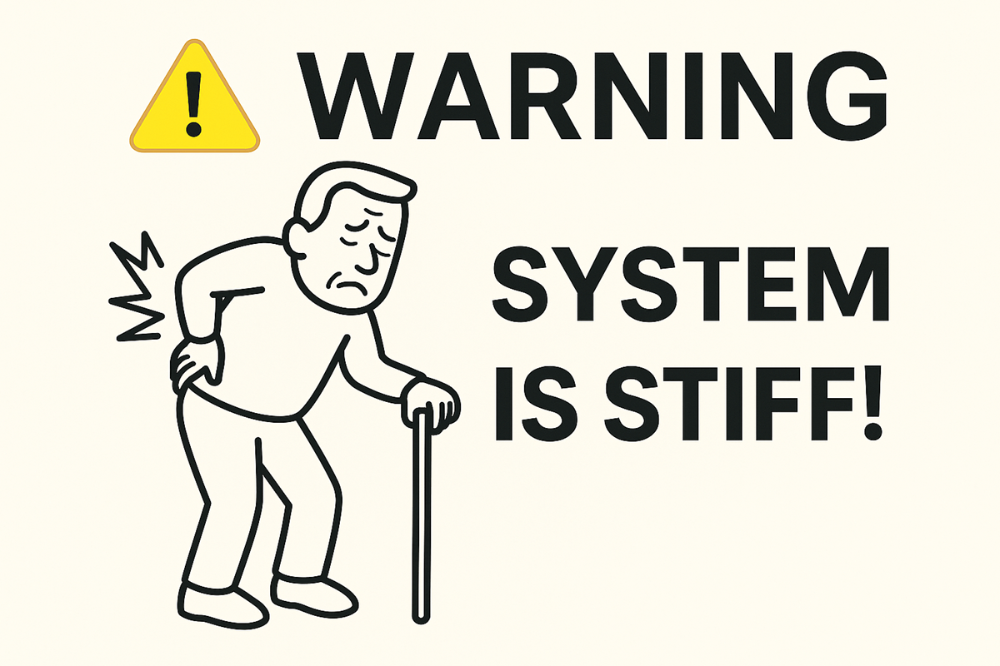
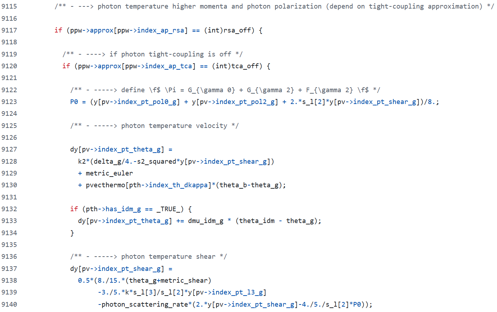
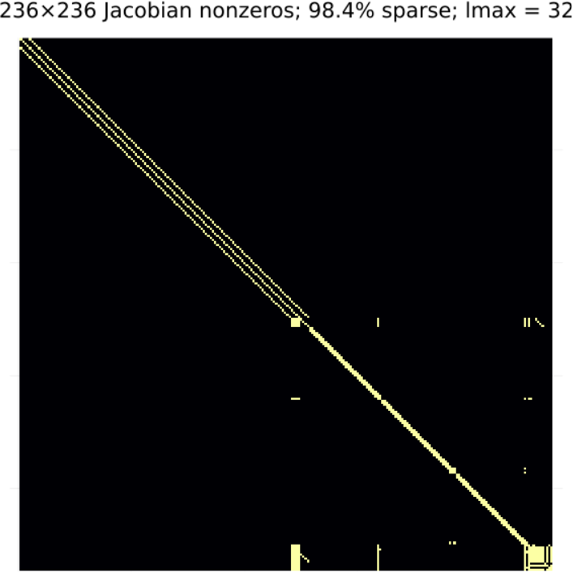
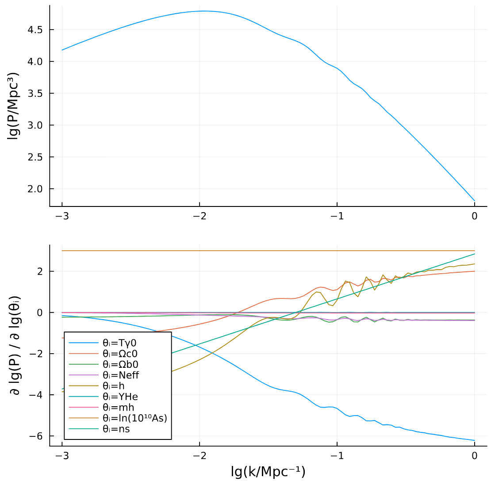
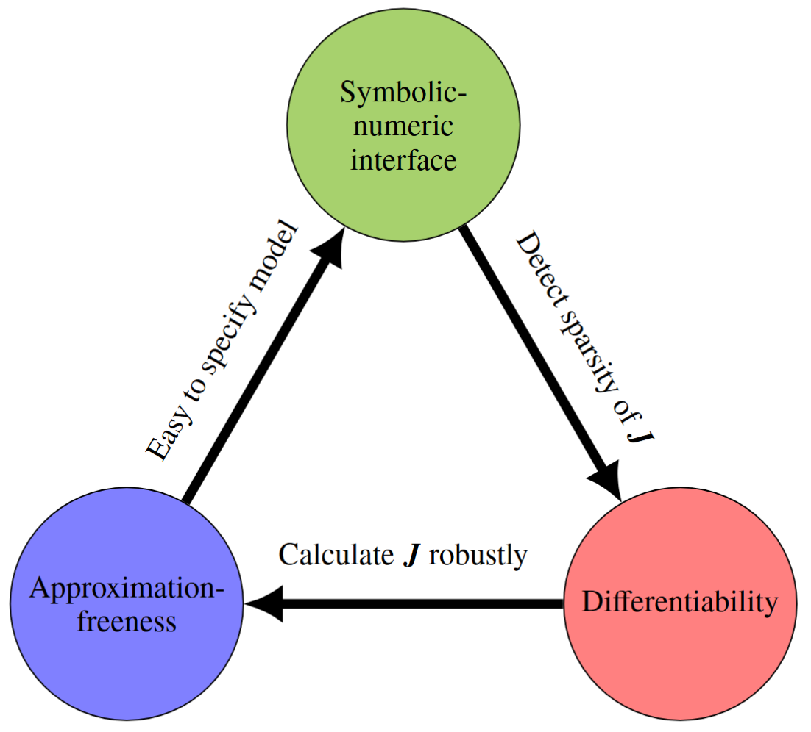

# Tensions call for theoretical extensions to ΛCDM

:::::::::::::: {.columns align=center}
::: {.column width="40%"}

)](media/hubble_tension.png){width=90%}

)](media/desi.png){width=90%}

:::
::: {.column width="60%"}

)](media/S8_tension2.png){width=65%}

)](media/modified_gravity.png){width=65%}

:::
::::::::::::::

- Want Boltzmann codes that are easy to extend

# Next-generation surveys need differentiable predictions

:::::: {.columns}

::: {.column width=60%}

- More nuisance parameters

- Sample $O(100)$-dim. param. spaces

- Want gradient-based MCMC (e.g. HMC/NUTS > MH)

 

{width=80%}

Two approaches:

- Emulators (of non-diff. codes)

- Differentiable codes

:::
::: {.column width=40%}

)](media/highdim.png)

:::
::::::

# History of Boltzmann codes

\scriptsize

**Year**              **Code**                                                                                             **Lang.**  **New features**
--------------------- ---------------------------------------------------------------------------------------------------- ---------- -------------------------------------------------
1995                  [COSMICS](https://arxiv.org/abs/astro-ph/9506072) [ ](https://arxiv.org/abs/astro-ph/9506070)        Fortran    First proper treatment; seminal paper
1996                  [CMBFAST](https://arxiv.org/abs/astro-ph/9603033)                                                    Fortran    Line-of-sight integration (lower perturbations $l_\text{max}$)
2000                  [CAMB](https://arxiv.org/abs/astro-ph/9911177) \emoji{sports-medal}                                  Fortran    Further development, non-flat models
2003                  [CMBEASY](https://arxiv.org/abs/astro-ph/0302138)                                                    C++        Object-oriented code structure
2011                  [CLASS](https://arxiv.org/abs/1104.2932) \emoji{sports-medal}                                        C          User-friendliness, flexibility, accuracy control, speed
2017                  [PyCosmo](https://arxiv.org/abs/1708.05177)                                                          Py/C++     Symbolic-numeric, code gen., approx.-free., sparsity
2021                  [Bolt](https://github.com/xzackli/Bolt.jl/)                                                          Julia      Differentiable, approx.-free
2024                  [DISCO-EB](https://arxiv.org/abs/2311.03291)                                                         Py/Jax     Differentiable, approx.-free, GPUs
2025                  [SymBoltz](https://github.com/hersle/SymBoltz.jl)                                                    Julia      Symbolic-numeric, approx.-free, differentiable

... and all forks thereof; e.g. [HiCLASS](https://arxiv.org/abs/1909.01828), [EFTCAMB](https://arxiv.org/abs/1312.5742), ...

# What do Einstein-Boltzmann codes do? (less technical)



- Simulates a universe described by some cosmological model

- Perturbative around a homo. & iso. FLRW background

- Foundation for many cosmological CMB/LSS analyses

# What do Einstein-Boltzmann codes do? (more technical)

\scriptsize
1. Read input parameters $\Omega_{m0}$, $\Omega_{b0}$, $T_{\gamma 0}$, $N_\mathrm{eff}$, $A_s$, $n_s$, $\ldots$

2. Solve background and thermodynamics ODEs:
   $$\tiny
   \begin{gathered}
   \left(\frac{\mathrm{d}a}{\mathrm{d}\tau}\right)^2 = \frac{8\pi}{3} \rho a^4, \quad
   \frac{\mathrm{d}{ρ}_s}{\mathrm{d}\tau} = -3 ℋ (ρ_s + P_s), \quad
   \frac{\mathrm{d}x_H}{\mathrm{d}\tau} = a C \left [\beta(T_b) (1-x_H) - n_H \alpha^{(2)}(T_b) x_H^2 \right], \quad
   \ldots
   \end{gathered}
   $$
\scriptsize

3. Solve perturbation ODEs (for several $k$):
   $$\tiny
   \begin{gathered}
   \frac{\mathrm{d}Φ}{\mathrm{d}\tau} = -\frac{4\pi}{3} a^2 ℋ \delta\rho - \frac{k^2}{3 ℋ} Φ - ℋ Ψ, \quad Φ - Ψ = \frac{12\pi a^2 Π}{k^2}, \\
   \frac{\mathrm{d} δ_s}{\mathrm{d}\tau} = -\Big(1+w_s\Big) \Big(θ_s-3\frac{\mathrm{d}Φ}{\mathrm{d}\tau}\Big) - 3 ℋ (cₛ²-w_s)δ_s, \quad
   \frac{\mathrm{d}θ_s}{\mathrm{d}\tau} = -ℋ(1-3w_s)θ_s + \frac{cₛ² k^2 δ_s}{1+w_s} + k^2 Ψ + \ldots
   \end{gathered}
   $$
\scriptsize

4. Solve line-of-sight integrals (for several $k$ and $l$)
   $$\tiny
   \begin{gathered}
   \frac{\mathrm{d}\Theta_l}{\mathrm{d}\tau} = \left[ g \left( Θ₀+Ψ+\frac{Π}{4} \right) + \frac{g u_b}{k} + e^{-τ} \frac{\mathrm{d}}{\mathrm{d}\tau}(Ψ-Φ) + \frac{3}{4 k^2} \frac{\mathrm{d}^2}{\mathrm{d}\tau^2} (gΠ) \right] j_l\big((k (\tau_0-\tau)\big)
   \end{gathered}
   $$
\scriptsize

5. Output some function of the ODEs/integrals, like $P(k)$ or $C_l$.

# SymBoltz solves background and perturbations


# Spectra agree with CLASS to around 0.1%

 

{width=80%}

# Feature 1: symbolic-numeric interface

\footnotesize



- Programmatically analyze symbolic representation of all equations:
  {width=80%}

- Compile code for ODEs $\frac{\mathrm{d}\mathbf{u}}{\mathrm{d}τ} = \mathbf{f}(\mathbf{u},\mathbf{p},τ)$ and Jacobians $J_{ij} = \frac{\partial f_i}{\partial u_j}$

- Built on [ModelingToolkit.jl](https://github.com/SciML/ModelingToolkit.jl) (think SymPy, but more simulation-focused)

- **Goal:** maximize convenience/speed/stability with minimal user input

# Interactive model-problem-solution workflow

```julia
# Load package
using SymBoltz

# 1) Define symbolic model
M = ΛCDM(lmax = 16)

# 2) Compile numerical problem
p = Dict(
 M.γ.T₀ => 2.7, M.b.Ω₀ => 0.05, M.b.YHe => 0.25,
 M.ν.Neff => 3.0, M.c.Ω₀ => 0.27, M.h.m_eV => 0.02,
 M.I.ln_As1e10 => 3.0, M.I.ns => 0.96, M.g.h => 0.7
)
prob = CosmologyProblem(M, p; jac = true, sparse = true)

# 3) Solve background and perturbations
ks = [4, 40, 400, 4000] # k / (H₀/c)
sol = solve(prob, ks)
```

# Easily get/plot any expressions from the solution

\tiny
```julia

p1 = plot(sol, log10(M.g.a), log10(M.g.ℋ))
p2 = plot(sol, log10(M.g.a), [M.b.Xe, M.b.rec.XH⁺, M.b.rec.XHe⁺⁺, M.b.rec.XHe⁺], legend_position = :left)
p3 = plot(sol, log10(M.g.a), [M.g.Φ, M.g.Ψ, M.g.Φ-M.g.Ψ], ks; legend_position = :left)
p4 = plot(sol, M.g.z, [M.ST_SW, 100*M.ST_ISW, M.ST_Doppler], ks[1:2]; xlims = (0, 2000), Nextra = 10)
plot(p1, p2, p3, p4, layout = (2, 2), size = (1000, 700))
```

{width=90%}

# Example: add $w₀wₐ$ dark energy

Implement equations from [arXiv:1002.1311](https://arxiv.org/abs/1002.1311):
$$
\begin{aligned}
w &= \frac{P}{\rho} = w_0 + w_a (1-a), \\
\frac{\mathrm{d}\rho}{\mathrm{d}\tau} &= -3 ℋ (\rho+P) \quad \rightarrow \quad \rho = ρ₀ a^{-3 (1 + w_0 + w_a)} e^{-3 w_a (1-a)}, \\
cₐ² &= w - \frac{1}{3ℋ(1+w)} \frac{\mathrm{d}w}{\mathrm{d}τ}, \\
\frac{\mathrm{d}\delta}{\mathrm{d}\tau} &= 3ℋ(w-c_s^2)δ - \Big(1+w\Big)\Big(\Big(1+9\Big(\frac{ℋ}{k}\Big)^2(c_s^2-c_a^2)\Big)θ - 3\frac{\mathrm{d}Φ}{\mathrm{d}τ}\Big), \\
\frac{\mathrm{d}θ}{\mathrm{d}τ} &= ℋ(3cₛ²-1)θ + \frac{k^2 cₛ² δ}{1+w} + k^2 Ψ, \\
\sigma &= 0 \\
\end{aligned}
$$

# Involved modification to CLASS {.allowframebreaks}

\footnotesize
[Official advice](https://lesgourg.github.io/class-tour/Padova/CLASS_Padova_Coding.pdf): `grep -Rn _fld include/ source/ python/`

1. Read input parameters and handle parameter dependencies:

\tiny
```
input.c:3177:  class_call(parser_read_double(pfc,"Omega_fld",&param2,&flag2,errmsg),
input.c:3186:             "'Omega_Lambda' or 'Omega_fld' must be left unspecified, except if 'Omega_scf' is set and < 0.");
input.c:3189:             "You have entered 'Omega_scf' < 0 , so you have to specify both 'Omega_lambda' and 'Omega_fld'.");
input.c:3215:    pba->Omega0_fld = param2;
input.c:3216:    Omega_tot += pba->Omega0_fld;
input.c:3232:    pba->Omega0_fld = 1. - pba->Omega0_k - Omega_tot;
input.c:3234:      printf(" -> matched budget equations by adjusting Omega_fld = %g\n",pba->Omega0_fld);
input.c:3248:  if (pba->Omega0_fld != 0.) {
input.c:3285:      class_read_double("w0_fld",pba->w0_fld);
input.c:3286:      class_read_double("wa_fld",pba->wa_fld);
input.c:3287:      class_read_double("cs2_fld",pba->cs2_fld);
input.c:3292:      class_read_double("w0_fld",pba->w0_fld);
input.c:3294:      class_read_double("cs2_fld",pba->cs2_fld);
```

\footnotesize
2. Add parameter hooks to Python wrapper, too:

\tiny
```
cclassy.pxd:91:        double Omega0_fld
cclassy.pxd:92:        double w0_fld
cclassy.pxd:93:        double wa_fld
cclassy.pxd:94:        double cs2_fld
```

\framebreak

\footnotesize
3. Declare background variables and indices

\tiny
```
background.h:104:  double Omega0_fld;       /**< \f$ \Omega_{0 de} \f$: fluid */
background.h:110:  double w0_fld;   /**< \f$ w0_{DE} \f$: current fluid equation of state parameter */
background.h:111:  double wa_fld;   /**< \f$ wa_{DE} \f$: fluid equation of state parameter derivative */
background.h:112:  double cs2_fld;  /**< \f$ c^2_{s~DE} \f$: sound speed of the fluid in the frame comoving with the fluid (so, this is
background.h:169:  int index_bg_rho_fld;       /**< fluid density */
background.h:170:  int index_bg_w_fld;         /**< fluid equation of state */
background.h:257:  int index_bi_rho_fld; /**< {B} fluid density */
background.h:289:  short has_fld;       /**< presence of fluid with constant w and cs2? */
background.h:416:  int background_w_fld(
background.h:419:                       double * w_fld,
background.h:420:                       double * dw_over_da_fld,
background.h:421:                       double * integral_fld);
```

\footnotesize
4. Compute background

\tiny
```
background.c:398:  double w_fld, dw_over_da, integral_fld;
background.c:540:  if (pba->has_fld == _TRUE_) {
background.c:542:    /* get rho_fld from vector of integrated variables */
background.c:543:    pvecback[pba->index_bg_rho_fld] = pvecback_B[pba->index_bi_rho_fld];
background.c:545:    /* get w_fld from dedicated function */
background.c:546:    class_call(background_w_fld(pba,a,&w_fld,&dw_over_da,&integral_fld), pba->error_message, pba->error_message);
background.c:547:    pvecback[pba->index_bg_w_fld] = w_fld;
background.c:550:    // pvecback[pba->index_bg_rho_fld] = pba->Omega0_fld * pow(pba->H0,2) / pow(a,3.*(1.+pba->w0_fld+pba->wa_fld)) * exp(3.*pba->wa_fld*(a-1.));
background.c:551:    // But now everthing is integrated numerically for a given w_fld(a) defined in the function background_w_fld.
background.c:553:    rho_tot += pvecback[pba->index_bg_rho_fld];
background.c:554:    p_tot += w_fld * pvecback[pba->index_bg_rho_fld];
background.c:555:    dp_dloga += (a*dw_over_da-3*(1+w_fld)*w_fld)*pvecback[pba->index_bg_rho_fld];
background.c:664:int background_w_fld(
background.c:667:                     double * w_fld,
background.c:668:                     double * dw_over_da_fld,
background.c:669:                     double * integral_fld
background.c:680:    *w_fld = pba->w0_fld + pba->wa_fld * (1. - a);
background.c:715:    *dw_over_da_fld = - pba->wa_fld;
background.c:738:    *integral_fld = 3.*((1.+pba->w0_fld+pba->wa_fld)*log(1./a) + pba->wa_fld*(a-1.));
background.c:985:  pba->has_fld = _FALSE_;
background.c:1012:  if (pba->Omega0_fld != 0.)
background.c:1013:    pba->has_fld = _TRUE_;
background.c:1080:  class_define_index(pba->index_bg_rho_fld,pba->has_fld,index_bg,1);
background.c:1081:  class_define_index(pba->index_bg_w_fld,pba->has_fld,index_bg,1);
background.c:1166:  class_define_index(pba->index_bi_rho_fld,pba->has_fld,index_bi,1);
background.c:1744:  double w_fld, dw_over_da, integral_fld;
background.c:1778:  if (pba->has_fld == _TRUE_) {
background.c:1780:    class_call(background_w_fld(pba,0.,&w_fld,&dw_over_da,&integral_fld), pba->error_message, pba->error_message);
background.c:1782:    class_test(w_fld >= 1./3.,
background.c:1785:               w_fld);
background.c:2150:  double rho_fld_today;
background.c:2151:  double w_fld,dw_over_da_fld,integral_fld;
background.c:2240:  if (pba->has_fld == _TRUE_) {
background.c:2242:    /* rho_fld today */
background.c:2243:    rho_fld_today = pba->Omega0_fld * pow(pba->H0,2);
background.c:2245:    /* integrate rho_fld(a) from a_ini to a_0, to get rho_fld(a_ini) given rho_fld(a0) */
background.c:2246:    class_call(background_w_fld(pba,a,&w_fld,&dw_over_da_fld,&integral_fld), pba->error_message, pba->error_message);
background.c:2254:    /* rho_fld at initial time */
background.c:2255:    pvecback_integration[pba->index_bi_rho_fld] = rho_fld_today * exp(integral_fld);
background.c:2453:  class_store_columntitle(titles,"(.)rho_fld",pba->has_fld);
background.c:2454:  class_store_columntitle(titles,"(.)w_fld",pba->has_fld);
background.c:2526:    class_store_double(dataptr,pvecback[pba->index_bg_rho_fld],pba->has_fld,storeidx);
background.c:2527:    class_store_double(dataptr,pvecback[pba->index_bg_w_fld],pba->has_fld,storeidx);
background.c:2652:  if (pba->has_fld == _TRUE_) {
background.c:2654:    dy[pba->index_bi_rho_fld] = -3.*(1.+pvecback[pba->index_bg_w_fld])*y[pba->index_bi_rho_fld];
```

\footnotesize
5. Declare perturbation variables

\tiny
```
perturbations.h:247:  short has_source_delta_fld;  /**< do we need source for delta of dark energy? */
perturbations.h:261:  short has_source_theta_fld;  /**< do we need source for theta of dark energy? */
perturbations.h:294:  int index_tp_delta_fld;  /**< index value for delta of dark energy */
perturbations.h:310:  int index_tp_theta_fld;   /**< index value for theta of dark energy */
perturbations.h:478:  int index_pt_delta_fld;  /**< dark energy density in true fluid case */
perturbations.h:479:  int index_pt_theta_fld;  /**< dark energy velocity in true fluid case */
```

\footnotesize
6. Compute perturbations

\tiny
```
perturbations.c:472:          class_store_double(dataptr,tk[ppt->index_tp_delta_fld],ppt->has_source_delta_fld,storeidx);
perturbations.c:501:          class_store_double(dataptr,tk[ppt->index_tp_theta_fld],ppt->has_source_theta_fld,storeidx);
perturbations.c:560:      class_store_columntitle(titles,"d_fld",pba->has_fld);
perturbations.c:589:      class_store_columntitle(titles,"t_fld",pba->has_fld);
perturbations.c:712:  double w_fld_ini, w_fld_0,dw_over_da_fld,integral_fld;
perturbations.c:1187:  ppt->has_source_delta_fld = _FALSE_;
perturbations.c:1202:  ppt->has_source_theta_fld = _FALSE_;
perturbations.c:1294:        if (pba->has_fld == _TRUE_)
perturbations.c:1295:          ppt->has_source_delta_fld = _TRUE_;
perturbations.c:1325:        if (pba->has_fld == _TRUE_)
perturbations.c:1326:          ppt->has_source_theta_fld = _TRUE_;
perturbations.c:1401:      class_define_index(ppt->index_tp_delta_fld,  ppt->has_source_delta_fld, index_type,1);
perturbations.c:1415:      class_define_index(ppt->index_tp_theta_fld,  ppt->has_source_theta_fld, index_type,1);
perturbations.c:3360:      class_store_columntitle(ppt->scalar_titles, "delta_rho_fld", pba->has_fld);
perturbations.c:3361:      class_store_columntitle(ppt->scalar_titles, "rho_plus_p_theta_fld", pba->has_fld);
perturbations.c:3362:      class_store_columntitle(ppt->scalar_titles, "delta_p_fld", pba->has_fld);
perturbations.c:3941:      class_define_index(ppv->index_pt_delta_fld,pba->has_fld,index_pt,1); /* fluid density */
perturbations.c:3942:      class_define_index(ppv->index_pt_theta_fld,pba->has_fld,index_pt,1); /* fluid velocity */
perturbations.c:4402:      if (pba->has_fld == _TRUE_) {
perturbations.c:4405:          ppv->y[ppv->index_pt_delta_fld] =
perturbations.c:4406:            ppw->pv->y[ppw->pv->index_pt_delta_fld];
perturbations.c:4408:          ppv->y[ppv->index_pt_theta_fld] =
perturbations.c:4409:            ppw->pv->y[ppw->pv->index_pt_theta_fld];
perturbations.c:5281:  double w_fld,dw_over_da_fld,integral_fld;
perturbations.c:5458:      if (pba->has_fld == _TRUE_) {
perturbations.c:5460:        class_call(background_w_fld(pba,a,&w_fld,&dw_over_da_fld,&integral_fld), pba->error_message, ppt->error_message);
perturbations.c:5463:          ppw->pv->y[ppw->pv->index_pt_delta_fld] = - ktau_two/4.*(1.+w_fld)*(4.-3.*pba->cs2_fld)/(4.-6.*w_fld+3.*pba->cs2_fld) * ppr->curvature_ini * s2_squared; /* from 1004.5509 */ //TBC: curvature
perturbations.c:5465:          ppw->pv->y[ppw->pv->index_pt_theta_fld] = - k*ktau_three/4.*pba->cs2_fld/(4.-6.*w_fld+3.*pba->cs2_fld) * ppr->curvature_ini * s2_squared; /* from 1004.5509 */ //TBC:curvature
perturbations.c:5740:      if ((pba->has_fld == _TRUE_) && (pba->use_ppf == _FALSE_)) {
perturbations.c:5742:        class_call(background_w_fld(pba,a,&w_fld,&dw_over_da_fld,&integral_fld), pba->error_message, ppt->error_message);
perturbations.c:5744:        ppw->pv->y[ppw->pv->index_pt_delta_fld] -= 3*(1.+w_fld)*a_prime_over_a*alpha;
perturbations.c:5745:        ppw->pv->y[ppw->pv->index_pt_theta_fld] += k*k*alpha;
perturbations.c:6719:  double w_fld,dw_over_da_fld,integral_fld;
perturbations.c:6727:  double w_prime_fld, ca2_fld;
perturbations.c:6730:  double rho_fld, p_fld, rho_fld_prime, p_fld_prime;
perturbations.c:6732:  double Gamma_fld, S, S_prime, theta_t, theta_t_prime, rho_plus_p_theta_fld_prime;
perturbations.c:7109:    if (pba->has_fld == _TRUE_) {
perturbations.c:7111:      class_call(background_w_fld(pba,a,&w_fld,&dw_over_da_fld,&integral_fld), pba->error_message, ppt->error_message);
perturbations.c:7112:      w_prime_fld = dw_over_da_fld * a_prime_over_a * a;
perturbations.c:7115:        ppw->delta_rho_fld = ppw->pvecback[pba->index_bg_rho_fld]*y[ppw->pv->index_pt_delta_fld];
perturbations.c:7116:        ppw->rho_plus_p_theta_fld = (1.+w_fld)*ppw->pvecback[pba->index_bg_rho_fld]*y[ppw->pv->index_pt_theta_fld];
perturbations.c:7117:        ca2_fld = w_fld - w_prime_fld / 3. / (1.+w_fld) / a_prime_over_a;
perturbations.c:7119:        ppw->delta_p_fld = pba->cs2_fld * ppw->delta_rho_fld + (pba->cs2_fld-ca2_fld)*(3*a_prime_over_a*ppw->rho_plus_p_theta_fld/k/k);
perturbations.c:7387:  double w_fld,dw_over_da_fld,integral_fld;
perturbations.c:7787:    /* delta_fld */
perturbations.c:7788:    if (ppt->has_source_delta_fld == _TRUE_) {
perturbations.c:7789:      _set_source_(ppt->index_tp_delta_fld) = ppw->delta_rho_fld/pvecback[pba->index_bg_rho_fld]
perturbations.c:7790:        + 3.*a_prime_over_a*(1.+pvecback[pba->index_bg_w_fld])*theta_over_k2; // N-body gauge correction
perturbations.c:7903:    /* theta_fld */
perturbations.c:7904:    if (ppt->has_source_theta_fld == _TRUE_) {
perturbations.c:7906:      class_call(background_w_fld(pba,a,&w_fld,&dw_over_da_fld,&integral_fld), pba->error_message, ppt->error_message);
perturbations.c:7908:      _set_source_(ppt->index_tp_theta_fld) = ppw->rho_plus_p_theta_fld/(1.+w_fld)/pvecback[pba->index_bg_rho_fld]
perturbations.c:8472:    class_store_double(dataptr, ppw->delta_rho_fld, pba->has_fld, storeidx);
perturbations.c:8473:    class_store_double(dataptr, ppw->rho_plus_p_theta_fld, pba->has_fld, storeidx);
perturbations.c:8474:    class_store_double(dataptr, ppw->delta_p_fld, pba->has_fld, storeidx);
perturbations.c:8683:  double w_fld,dw_over_da_fld,w_prime_fld,integral_fld;
perturbations.c:9269:    if (pba->has_fld == _TRUE_) {
perturbations.c:9276:        class_call(background_w_fld(pba,a,&w_fld,&dw_over_da_fld,&integral_fld), pba->error_message, ppt->error_message);
perturbations.c:9277:        w_prime_fld = dw_over_da_fld * a_prime_over_a * a;
perturbations.c:9279:        ca2 = w_fld - w_prime_fld / 3. / (1.+w_fld) / a_prime_over_a;
perturbations.c:9280:        cs2 = pba->cs2_fld;
perturbations.c:9284:        dy[pv->index_pt_delta_fld] =
perturbations.c:9285:          -(1+w_fld)*(y[pv->index_pt_theta_fld]+metric_continuity)
perturbations.c:9286:          -3.*(cs2-w_fld)*a_prime_over_a*y[pv->index_pt_delta_fld]
perturbations.c:9287:          -9.*(1+w_fld)*(cs2-ca2)*a_prime_over_a*a_prime_over_a*y[pv->index_pt_theta_fld]/k2;
perturbations.c:9291:        dy[pv->index_pt_theta_fld] = /* fluid velocity */
perturbations.c:9292:          -(1.-3.*cs2)*a_prime_over_a*y[pv->index_pt_theta_fld]
perturbations.c:9293:          +cs2*k2/(1.+w_fld)*y[pv->index_pt_delta_fld]
```

\footnotesize

- Things related to one species scattered in many places

- A lot of boilerplate code for mechanical tasks → unnecessary

- In CLASS' defence, it handles more general $w(a)$ models

# Short modification to SymBoltz

:::::: {.columns}
::: {.column width=55%}

\tiny
```julia
# 1) Create w0wa species "X"
g, τ, k = M.g, M.τ, M.k
a, ℋ, Φ, Ψ = g.a, g.ℋ, g.Φ, g.Ψ
D = Differential(τ)
@parameters w₀ wₐ cₛ² Ω₀ ρ₀
@variables ρ(τ) P(τ) w(τ) cₐ²(τ) δ(τ, k) θ(τ, k) σ(τ, k)
eqs = [
  w ~ w₀ + wₐ*(1-a)
  ρ₀ ~ 3*Ω₀ / (8*Num(π))
  ρ ~ ρ₀ * a^(-3(1+w₀+wₐ)) * exp(-3wₐ*(1-a))
  P ~ w * ρ
  cₐ² ~ w - 1/(3ℋ) * D(w)/(1+w)
  D(δ) ~ 3ℋ*(w-cₛ²)*δ - (1+w)*((1+9(ℋ/k)^2*(cₛ²-cₐ²))*θ - 3*D(Φ))
  D(θ) ~ (3cₛ²-1)*ℋ*θ + k^2*cₛ²*δ/(1+w) + k^2*Ψ
  σ ~ 0
]
initialization_eqs = [
  δ ~ -3//2 * (1+w) * Ψ
  θ ~ 1//2 * (k^2*τ) * Ψ
]
X = System(eqs, τ; initialization_eqs, name = :X)

# 2) Create extended model and problem
M = ΛCDM(Λ = X, lmax = 16, name = :w₀wₐCDM)
push!(p, X.w₀ => -0.9, X.wₐ => 0.2, X.cₛ² => 1.0)
prob = CosmologyProblem(M, p; jac=true, sparse=true)
```

:::
::: {.column width=45%}

\scriptsize

Symbolic engine does mechanical tasks:

\tiny

- parameter hooks (e.g. $w_0$, $w_a$, $c_s^2$, $\Omega_{0}$),

- move $(\tau)$-functions to background,

- move $(\tau,k)$-functions to perturbations,

- expand $\texttt{D(w)} \!=\! \mathrm{d}w/\mathrm{d}\tau$ and $\texttt{D(Φ)} \!=\! \mathrm{d}\Phi/\mathrm{d}\tau$,

- look up background in perturbations,

- source gravity with energy-momentum,

- spline $\rho(\tau)$ in the perturbations (if integrating $\mathrm{d}\rho/\mathrm{d}\tau$),

- set $\Omega_{X0} = 1 - \sum_{s \neq {X}} \Omega_{s0}$ (if GR),

- eliminate common subexpressions like $x\!=\!1+w$ and $y\!=\!1/x$,

- generate ODE code/indices for $\delta^\prime$ and $\theta^\prime$,

- generate sparse anal. $J_{ij}$ for $\delta^\prime$ and $\theta^\prime$,

- output any variable, both unknowns (i.e. $\delta$, $\theta$) and observeds (e.g. $w$, $c_a^2$).

- lower higher-order derivs. to 1 (e.g. $\frac{\mathrm{d}^2 \phi}{\mathrm{d} \tau^2}$),

- everything related to one species in one place,

- compact and readable unicode code.

:::
::::::

# Other codes are structured by computational stages

:::::::::::::: {.columns}
::: {.column width="25%"}

\scalebox{0.66}{
\begin{tabular}{c}
{\tt input.c} \\
$\downarrow$\\
{\tt \colorbox{red!80}{background.c}} \\
$\downarrow$\\
{\tt \colorbox{blue!80}{thermodynamics.c}} \\
$\downarrow$\\
{\tt \colorbox{green!80}{perturbations.c}} \\
$\downarrow$\\
{\tt bessel.c} \\
$\downarrow$\\
{\tt \colorbox{yellow!80}{transfer.c}} \\
$\downarrow$\\
{\tt primordial.c} \\
$\downarrow$\\
{\tt spectra.c} \\
$\downarrow$\\
{\tt nonlinear.c} \\
$\downarrow$\\
{\tt lensing.c} \\
$\downarrow$\\
{\tt output.c}\\
\end{tabular}
}

\normalsize
CLASS structure

:::
::: {.column width="75%"}

$$
\begin{gathered}
\mathbf{J} = [ \partial u_i^\prime / \partial u_j ] \sim \\
\tiny
\setcounter{MaxMatrixCols}{20}
\setlength{\arraycolsep}{4pt}
\begin{bNiceMatrix}[
    margin,
    first-col,
    last-row,
    code-for-first-col = \color{gray},
    code-for-last-row = \color{gray},
    columns-width=auto
]
{a}^\prime & \cellcolor{red!80}{1} & 0 & 0 & 0 & 0 & 0 & 0 & 0 & 0 & 0 & 0 & 0 & 0 & 0 & 0 & 0 & 0 \\
{X_\mathrm{H}^+}^\prime & \cellcolor{blue!20}{1} & \cellcolor{blue!80}{1} & \cellcolor{blue!80}{1} & \cellcolor{blue!80}{1} & \cellcolor{blue!80}{0} & 0 & 0 & 0 & 0 & 0 & 0 & 0 & 0 & 0 & 0 & 0 & 0 \\
{X_\mathrm{He}^+}^\prime & \cellcolor{blue!20}{1} & \cellcolor{blue!80}{1} & \cellcolor{blue!80}{1} & \cellcolor{blue!80}{1} & \cellcolor{blue!80}{0} & 0 & 0 & 0 & 0 & 0 & 0 & 0 & 0 & 0 & 0 & 0 & 0 \\
{T_b}^\prime & \cellcolor{blue!20}{1} & \cellcolor{blue!80}{1} & \cellcolor{blue!80}{1} & \cellcolor{blue!80}{1} & \cellcolor{blue!80}{0} & 0 & 0 & 0 & 0 & 0 & 0 & 0 & 0 & 0 & 0 & 0 & 0 \\
{κ}^\prime & \cellcolor{blue!20}{1} & \cellcolor{blue!80}{1} & \cellcolor{blue!80}{1} & \cellcolor{blue!80}{1} & \cellcolor{blue!80}{0} & 0 & 0 & 0 & 0 & 0 & 0 & 0 & 0 & 0 & 0 & 0 & 0 \\
{Φ}^\prime & \cellcolor{green!20}{1} & \cellcolor{green!20}{0} & \cellcolor{green!20}{0} & \cellcolor{green!20}{0} & \cellcolor{green!20}{0} & \cellcolor{green!80}{1} & \cellcolor{green!80}{1} & \cellcolor{green!80}{0} & \cellcolor{green!80}{1} & \cellcolor{green!80}{0} & \cellcolor{green!80}{1} & \cellcolor{green!80}{0} & \cellcolor{green!80}{1} & \cellcolor{green!80}{0} & \cellcolor{green!80}{0} & \cellcolor{green!80}{0} & 0 \\
{δ_c}^\prime & \cellcolor{green!20}{1} & \cellcolor{green!20}{0} & \cellcolor{green!20}{0} & \cellcolor{green!20}{0} & \cellcolor{green!20}{0} & \cellcolor{green!80}{1} & \cellcolor{green!80}{1} & \cellcolor{green!80}{1} & \cellcolor{green!80}{1} & \cellcolor{green!80}{0} & \cellcolor{green!80}{1} & \cellcolor{green!80}{0} & \cellcolor{green!80}{1} & \cellcolor{green!80}{0} & \cellcolor{green!80}{0} & \cellcolor{green!80}{0} & 0 \\
{θ_c}^\prime & \cellcolor{green!20}{1} & \cellcolor{green!20}{0} & \cellcolor{green!20}{0} & \cellcolor{green!20}{0} & \cellcolor{green!20}{0} & \cellcolor{green!80}{1} & \cellcolor{green!80}{0} & \cellcolor{green!80}{1} & \cellcolor{green!80}{0} & \cellcolor{green!80}{0} & \cellcolor{green!80}{0} & \cellcolor{green!80}{0} & \cellcolor{green!80}{1} & \cellcolor{green!80}{0} & \cellcolor{green!80}{0} & \cellcolor{green!80}{0} & 0 \\
{δ_b}^\prime & \cellcolor{green!20}{1} & \cellcolor{green!20}{1} & \cellcolor{green!20}{1} & \cellcolor{green!20}{1} & \cellcolor{green!20}{0} & \cellcolor{green!80}{1} & \cellcolor{green!80}{1} & \cellcolor{green!80}{0} & \cellcolor{green!80}{1} & \cellcolor{green!80}{1} & \cellcolor{green!80}{1} & \cellcolor{green!80}{0} & \cellcolor{green!80}{1} & \cellcolor{green!80}{0} & \cellcolor{green!80}{0} & \cellcolor{green!80}{0} & 0 \\
{θ_b}^\prime & \cellcolor{green!20}{1} & \cellcolor{green!20}{1} & \cellcolor{green!20}{1} & \cellcolor{green!20}{1} & \cellcolor{green!20}{0} & \cellcolor{green!80}{1} & \cellcolor{green!80}{0} & \cellcolor{green!80}{0} & \cellcolor{green!80}{1} & \cellcolor{green!80}{1} & \cellcolor{green!80}{0} & \cellcolor{green!80}{1} & \cellcolor{green!80}{1} & \cellcolor{green!80}{0} & \cellcolor{green!80}{0} & \cellcolor{green!80}{0} & 0 \\
{F_{γ0}}^\prime & \cellcolor{green!20}{1} & \cellcolor{green!20}{0} & \cellcolor{green!20}{0} & \cellcolor{green!20}{0} & \cellcolor{green!20}{0} & \cellcolor{green!80}{1} & \cellcolor{green!80}{1} & \cellcolor{green!80}{0} & \cellcolor{green!80}{1} & \cellcolor{green!80}{0} & \cellcolor{green!80}{1} & \cellcolor{green!80}{1} & \cellcolor{green!80}{1} & \cellcolor{green!80}{0} & \cellcolor{green!80}{0} & \cellcolor{green!80}{0} & 0 \\
{F_{γ1}}^\prime & \cellcolor{green!20}{1} & \cellcolor{green!20}{1} & \cellcolor{green!20}{1} & \cellcolor{green!20}{1} & \cellcolor{green!20}{0} & \cellcolor{green!80}{1} & \cellcolor{green!80}{0} & \cellcolor{green!80}{0} & \cellcolor{green!80}{0} & \cellcolor{green!80}{1} & \cellcolor{green!80}{1} & \cellcolor{green!80}{1} & \cellcolor{green!80}{1} & \cellcolor{green!80}{0} & \cellcolor{green!80}{0} & \cellcolor{green!80}{0} & 0 \\
{F_{γ2}}^\prime & \cellcolor{green!20}{1} & \cellcolor{green!20}{1} & \cellcolor{green!20}{1} & \cellcolor{green!20}{1} & \cellcolor{green!20}{0} & \cellcolor{green!80}{0} & \cellcolor{green!80}{0} & \cellcolor{green!80}{0} & \cellcolor{green!80}{0} & \cellcolor{green!80}{0} & \cellcolor{green!80}{0} & \cellcolor{green!80}{1} & \cellcolor{green!80}{1} & \cellcolor{green!80}{1} & \cellcolor{green!80}{0} & \cellcolor{green!80}{0} & 0 \\
{F_{γ3}}^\prime & \cellcolor{green!20}{1} & \cellcolor{green!20}{1} & \cellcolor{green!20}{1} & \cellcolor{green!20}{1} & \cellcolor{green!20}{0} & \cellcolor{green!80}{0} & \cellcolor{green!80}{0} & \cellcolor{green!80}{0} & \cellcolor{green!80}{0} & \cellcolor{green!80}{0} & \cellcolor{green!80}{0} & \cellcolor{green!80}{0} & \cellcolor{green!80}{1} & \cellcolor{green!80}{1} & \cellcolor{green!80}{1} & \cellcolor{green!80}{0} & 0 \\
{F_{γ4}}^\prime & \cellcolor{green!20}{1} & \cellcolor{green!20}{1} & \cellcolor{green!20}{1} & \cellcolor{green!20}{1} & \cellcolor{green!20}{0} & \cellcolor{green!80}{0} & \cellcolor{green!80}{0} & \cellcolor{green!80}{0} & \cellcolor{green!80}{0} & \cellcolor{green!80}{0} & \cellcolor{green!80}{0} & \cellcolor{green!80}{0} & \cellcolor{green!80}{0} & \cellcolor{green!80}{1} & \cellcolor{green!80}{1} & \cellcolor{green!80}{1} & 0 \\
{F_{γ5}}^\prime & \cellcolor{green!20}{1} & \cellcolor{green!20}{1} & \cellcolor{green!20}{1} & \cellcolor{green!20}{1} & \cellcolor{green!20}{0} & \cellcolor{green!80}{0} & \cellcolor{green!80}{0} & \cellcolor{green!80}{0} & \cellcolor{green!80}{0} & \cellcolor{green!80}{0} & \cellcolor{green!80}{0} & \cellcolor{green!80}{0} & \cellcolor{green!80}{0} & \cellcolor{green!80}{0} & \cellcolor{green!80}{1} & \cellcolor{green!80}{1} & 0 \\
{Θ_{γl}}^\prime & \cellcolor{yellow!20}{1} & \cellcolor{yellow!20}{1} & \cellcolor{yellow!20}{1} & \cellcolor{yellow!20}{1} & \cellcolor{yellow!20}{1} & \cellcolor{yellow!20}{1} & \cellcolor{yellow!20}{1} & \cellcolor{yellow!20}{0} & \cellcolor{yellow!20}{1} & \cellcolor{yellow!20}{1} & \cellcolor{yellow!20}{1} & \cellcolor{yellow!20}{1} & \cellcolor{yellow!20}{1} & \cellcolor{yellow!20}{1} & \cellcolor{yellow!20}{0} & \cellcolor{yellow!20}{0} & \cellcolor{yellow!80}{0} \\
& \mathclap{a} & \mathclap{X_\mathrm{H}^+} & \mathclap{X_\mathrm{He}^+} & \mathclap{T_b} & \mathclap{κ} & \mathclap{Φ} & \mathclap{δ_c} & \mathclap{θ_c} & \mathclap{δ_b} & \mathclap{θ_b} & \mathclap{F_{γ0}} & \mathclap{F_{γ1}} & \mathclap{F_{γ2}} & \mathclap{F_{γ3}} & \mathclap{F_{γ4}} & \mathclap{F_{γ5}} & \mathclap{Θ_{γl}}
\end{bNiceMatrix}
\end{gathered}
$$

Reflects variable dependencies in the full system

 

:::
::::::::::::::

:::::: {.columns}
::: {.column width="35%"}

- Spline prev. stages

:::
::: {.column width="65%"}

- Scatters one species across many files

:::
::::::

# SymBoltz is structured by physical components



- All (background/perturbations) equations written in one system

- Background/perturbations are automatically split internally

- Everything related to one component located in one place

- Perturbations can freely refer to the background

- **Goal:** work with all equations as if part of one big system

# Feature 2: approximation-freeness

```{=latex}
\begin{center}
```
{width=70%}
```{=latex}
\end{center}
```

\footnotesize
Einstein-Boltzmann equations are stiff due to different \textcolor{red}{(inverse) time scales}, e.g.:

$$\frac{\mathrm{d} θ_b}{\mathrm{d}τ} = -\textcolor{red}{ℋ} θ_b + \textcolor{red}{k^2} cₛ² δ_b - \frac{4ρ_γ}{3ρᵦ} \textcolor{red}{\dot{\kappa}} (θ_γ - θ_b)$$

Standard explicit ODE integrators (e.g. RK4) take tiny steps and crash!

# Solution 1: remove stiffness with approximations

:::::::::::::: {.columns}
::: {.column width="64%"}

Remove stiffness (and speed up) with approximation schemes:

- tight coupling (TCA)

- radiation streaming (RSA)

- ultra-relativistic fluid (UFA)

- non-cold dark matter fluid (NCDMFA)

- Saha approximation

:::
::: {.column width="36%"}

)](media/approximations.png){height=50%}

:::
::::::::::::::

- Complicates equations and code (also harder to differentiate)

- Switching criteria must be tuned (repeat for modifications)

- Approximations must be validated (repeat for modifications)

- Extensions reintroduce stiffness and need new approximations

- Biases extensions to less complicated sectors?

# Approximations complicate the code

[](https://github.com/lesgourg/class_public/blob/e85808324f51fc694d12e3ed7439552a3c3f9540/source/perturbations.c#L9115)

:::::: {.columns}
::: {.column width=50%}

- Several versions of equations

:::
::: {.column width=50%}

- Nested `if`-`else` branching

:::
::::::

# Solution 2: integrate full stiff equations with implicit solvers

- Designed to solve stiff systems

- **Challenge:** every step solves $N ∼ O(100)$ implicit eqs., e.g.:
  $$
  \begin{aligned}
  \text{Explicit Euler method: } \textcolor{red}{\mathbf{u}_{n+1}} &= \mathbf{u}_n + h \, \mathbf{f}(\mathbf{u}_n, t_n) \\
  \text{Implicit Euler method: } \textcolor{red}{\mathbf{u}_{n+1}} &= \mathbf{u}_n + h \, \mathbf{f}(\textcolor{red}{\mathbf{u}_{n+1}}, t_n)
  \end{aligned}
  $$

- Nonlinear solver (e.g. Newton's method) → needs ODE $\mathbf{J}$

  - Symbolic equations → analytical $\mathbf{J}$

- Dense LU-fact. is $O(N^3)$ → want $O(\mathrm{nnz})$ sparse matrices

  - Symbolic equations → exact sparsity pattern of $\mathbf{J}$

  - Approximation-free → fixed sparsity pattern of $\mathbf{J}$

- Handled by Julia's powerful [OrdinaryDiffEq.jl](https://github.com/SciML/OrdinaryDiffEq.jl/) library

- **Reward:** long steps, one simple equation set, no switching

# Symbolic codes compute the Jacobian analytically

By definition, the perturbation ODEs $f_i = \sum_j A_{ij} u_j$ are linear.

$$
\begin{aligned}
&\implies J_{ij} = \partial f_i / \partial u_j = A_{ij} \\
&\implies f_i = \sum_j J_{ij} u_j \\
&\implies \text{sparse $\mathbf{J}$ requires fewer operations than $\mathbf{f}$}
\end{aligned}
$$


 

:::::: {.columns}

::: {.column width=50%}

CLASS (\emoji{slightly-frowning-face}):

- Knows only $\mathbf{f}$

- Computes approximate $\mathbf{J}$ with $O(N)$ finite-difference evaluations of $\mathbf{f}$.

:::

::: {.column width=50%}

SymBoltz (\emoji{slightly-smiling-face}):

- Knows both $\mathbf{f}$ and $\mathbf{J}$

- Computes exact $\mathbf{J}$ from 1 analytical evaluation with *fewer* operations than $\mathbf{f}$.

:::
::::::

# Big speedup from sparse matrix methods

:::::: {.columns}
::: {.column width=40%}



:::
::: {.column width=60%}


:::
::::::

# Performance is good: work vs. precision diagram

Choice of implicit solver matters!

{width=80%}

\scriptsize
(Line-of-sight integration for $C_l$ not yet as fast as CLASS)

# Comparison of approximation/performance characteristics

\tiny
\setlength{\tabcolsep}{2pt}

                           CAMB                  CLASS                                 PyCosmo                       DISCO-EB                            Bolt                                SymBoltz
-------------------------- -------------------   ---------------------------------     --------------------          --------------------                --------------------                ---------------------
Best implicit solver       -                     `ndf15`                               `BDF2`                        `Kvaerno5`                          `KenCarp4`                          `Rodas5P`
Approximation-free         \cellcolor{red}No     \cellcolor{yellow}Almost${}^1$        \cellcolor{green}Yes          \cellcolor{green}Yes                \cellcolor{green}Yes                \cellcolor{green}Yes
Solver order (stable)      -                     \cellcolor{yellow}1-5 (2)${}^2$       \cellcolor{yellow}2 (2)       \cellcolor{green}5 (5)              \cellcolor{green}4 (4)              \cellcolor{green}5 (5)
Newton iterations          -                     \cellcolor{red}Yes                    \cellcolor{green}No${}^3$     \cellcolor{red}Yes                  \cellcolor{red}Yes                  \cellcolor{green}No${}^4$
Jacobian method            -                     \cellcolor{red}$O(N)$ fin.diff.       \cellcolor{green}$O(1)$ anal. \cellcolor{yellow}$O(N)$ auto.diff. \cellcolor{yellow}$O(N)$ auto.diff. \cellcolor{green}$O(1)$ anal.
Jacobian sparsity          -                     \cellcolor{yellow}Dynamic${}^5$       \cellcolor{green}Fixed        \cellcolor{red}Not supported        \cellcolor{red}Not supported        \cellcolor{green}Fixed

- ${}^1$[Tight-coupling approximation is mandatory](https://github.com/lesgourg/class_public/blob/e85808324f51fc694d12e3ed7439552a3c3f9540/include/perturbations.h#L42), but others can be disabled.

- ${}^2$BDF methods are "A-stable" and "L-stable" only to 2nd order (e.g. [doi.org/10.1137/S1064827594276424](https://doi.org/10.1137/S1064827594276424)).

- ${}^3$Custom `BDF2` method specializing on linearity $\mathbf{f} = \mathbf{J} \mathbf{u}$ (see [1708.05177](https://arxiv.org/abs/1708.05177) eq. (21)).

- ${}^4$Rosenbrock methods linearize $\mathbf{f} = \mathbf{J} \mathbf{u}$ (e.g. [doi.org/10.1007/s10543-023-00967-x](https://doi.org/10.1007/s10543-023-00967-x)).

- ${}^5$Sparsity found numerically and changes with approximations.

# Feature 3: differentiability

:::::::::::::: {.columns}
::: {.column width="50%"}

Derivatives are important in e.g.:

 

- Gradient-baed MCMCs: HMC, NUTS

- Training machine learning emulators (minimize loss)

- Fisher forecasting

- Sensitivity analysis: $∂(\mathrm{output}) / ∂(\mathrm{input})$

 

Autodiff propagates exact gradients through the code:

:::
::: {.column width="50%"}



:::
::::::::::::::

# What is automatic differentiation?

Any computer program is one (big) composite function
$$
\mathbf{f} = \mathbf{f}_N \circ \mathbf{f}_{N-1} \circ \cdots \circ \mathbf{f}_2 \circ \mathbf{f}_1 = \mathbf{f}_N(\mathbf{f}_{N-1}( \cdots \mathbf{f}_2(\mathbf{f}_1)))
$$

**Finite differences:** approximate $J_{ij} ≈ \frac{\mathbf{f}(\mathbf{x} + \mathbf{e}_j \frac{ϵ}{2}) - \mathbf{f}(\mathbf{x} - \mathbf{e}_j \frac{ϵ}{2})}{ϵ} \cdot \mathbf{e}_i$.

**Automatic differentiation:** any method computing chain rule
$$
\mathbf{J} = \mathbf{J}_N \cdot \mathbf{J}_{N-1} \cdots \mathbf{J}_2 \cdot \mathbf{J}_1 = \frac{\partial\,\mathbf{f}_{N}}{\partial\,\mathbf{f}_{N-1}} \cdot \frac{\partial\,\mathbf{f}_{N-1}}{\partial\,\mathbf{f}_{N-2}} \cdots \frac{\partial\,\mathbf{f}_{3}}{\partial\,\mathbf{f}_{2}} \cdot \frac{\partial\,\mathbf{f}_{2}}{\partial\,\mathbf{f}_{1}}.
$$

- Source code transformation ($\mathbf{f} → \text{compiler} → \mathbf{J}$)

- Dual numbers (number type with $(\mathbf{f}, \mathbf{f}^\prime)$)

Unlike $\mathbf{f}$, the product for $\mathbf{J}$ can be evaluated in any order:

- Forward-mode seeds $\mathbf{J}_1=\mathbf{1}$; fastest when $\mathbf{f}$ has more outputs

- Reverse-mode seeds $\mathbf{J}_N=\mathbf{1}$; fastest when $\mathbf{f}$ has more inputs

# Example: finite differences vs. automatic differentiation

\scriptsize
```julia
function f(x)
    println("typeof(x) = ", typeof(x))
    return x^2
end

f(3.0)
# typeof(x) = Float64
# 9.0

# 1) Finite differences
ϵ = 1e-10
(f(3.0+ϵ/2) - f(3.0-ϵ/2)) / ϵ
# typeof(x) = Float64
# typeof(x) = Float64
# 6.000000496442226

# 2) Automatic differentiation (forward-mode dual numbers)
using ForwardDiff
ForwardDiff.derivative(f, 3.0)
# typeof(x) = ForwardDiff.Dual{ForwardDiff.Tag{typeof(f), Float64}, Float64, 1}
# 6.0
```

# Forward-mode AD works in SymBoltz

\scriptsize
Can do differentiable Fisher forecasting, e.g. for cosmic variance-dominated CMB survey:
$$
\begin{gathered}
\log L(\mathbf{p}) = -\frac12 \sum_l \bigg( \frac{C_l(\mathbf{p}) - \bar{C}_l}{\sigma_l^2} \bigg)^2,
\quad
\sigma_l = \sqrt{\frac{2}{2l+1}} \bar{C}_l, \\
F_{ij} = -\frac12 \frac{\partial^2 \log L}{\partial p_i \partial p_j} = \sum_l \textcolor{red}{\frac{\partial C_l}{\partial p_i}} \frac{1}{\sigma_l^2} \textcolor{red}{\frac{\partial C_l}{\partial p_j}}
\end{gathered}
$$

:::::: {.columns}

::: {.column width=50%}


- CLASS requires step size tuning

- SymBoltz currently slower for differentiable runs

:::

::: {.column width=50%}


:::

::::::

# Reverse-mode AD does not work yet in SymBoltz

- Most attractive for MCMCs, since $L(\mathbf{p})$ is vector-to-scalar

- Want to enable use of gradient-based MCMC methods:

)](media/mh_vs_hmc.png)

- **Goal:** $T(L,∇L)⋅N(\text{NUTS}) < T(L)⋅N(\text{MH})$ ([2406.04725](https://arxiv.org/abs/2406.04725))

# Main features reinforce each other

{width=70%}

# Current feature status and future work

```{=latex}
\scriptsize
\begin{multicols}{3}
\emoji{green-square} Baryons (RECFAST) \\
\emoji{green-square} Photons \\
\emoji{green-square} Cold dark matter \\
\emoji{green-square} Massless neutrinos \\
\emoji{green-square} Massive neutrinos \\
\emoji{green-square} Cosmological constant \\
\emoji{green-square} $w_0 w_a$ dark energy \\
\emoji{green-square} General Relativity \\
\emoji{yellow-square} Brans-Dicke gravity \\
\emoji{yellow-square} Curved geometry \\
\emoji{green-square} Scalar perturbations \\
\emoji{red-square} Vector perturbations \\
\emoji{red-square} Tensor perturbations \\
\emoji{green-square} Matter power spectrum \\
\emoji{green-square} CMB power spectrum \\
\emoji{yellow-square} CMB lensing \\
\emoji{green-square} Symbolic interface \\
\emoji{green-square} Auto stage separation \\
\emoji{green-square} Auto spline ODE vars \\
\emoji{green-square} Auto compute alg vars \\
\emoji{green-square} Auto $(\tau, k)$-interpolate \\
\emoji{green-square} Auto parameter hooks \\
\emoji{yellow-square} Auto gauge transf \\
\emoji{yellow-square} Auto initial conditions \\
\emoji{red-square} Auto unit conversion \\
\emoji{green-square} Auto plot recipes \\
\emoji{green-square} Shooting method \\
\emoji{green-square} Approximation-free \\
\emoji{green-square} Performance \\
\emoji{green-square} Forward-mode autodiff \\
\emoji{red-square} Reverse-mode autodiff \\
\emoji{yellow-square} Performance (autodiff) \\
\emoji{green-square} Documentation \\
\emoji{green-square} Testing \\
\emoji{green-square} CLASS comparison \\
\emoji{yellow-square} Non-linear boosting \\
\emoji{red-square} GPU support \\
\emoji{green-square} Paper (arXiv) \\
\emoji{black-large-square} \textbf{Ideas welcome!}
\end{multicols}
```

# The end

Available [github.com/hersle/SymBoltz.jl](https://github.com/hersle/SymBoltz.jl)

- Install with `using Pkg; Pkg.add("SymBoltz")` in Julia

- Link to [documentation](https://hersle.github.io/SymBoltz.jl/stable) and [paper](https://arxiv.org/abs/2509.24740) {height=3%}

- Star Github if you find this interesting :) {height=3%}

- Looking for people to try it and give feedback!

- Feel free to open issues on Github!

 

## Thank you!
