# Tensions call for extensions to the standard ΛCDM model

\vspace{0.2cm}

:::::::::::::: {.columns align=center}
::: {.column width="40%"}

)](media/hubble_tension.png){width=90%}

)](media/desi.png){width=90%}

:::
::: {.column width="60%"}

)](media/S8_tension2.png){width=65%}

)](media/modified_gravity.png){width=65%}

:::
::::::::::::::

\normalsize

- Want easy-to-modify modeling tools.

# Next-generation surveys call for differentiable predictions

:::::: {.columns}
::: {.column width=62%}

 

 

Parameters are inferred with Markov chain Monte Carlo (MCMC).

 

- **Problem:** Upcoming surveys have more nuisance parameters. MCMCs must sample $O(100)$-dimensional parameter spaces ([2405.12965](https://arxiv.org/abs/2405.12965)).

 

 

- **Solution:** HMC faster than MH in many dimensions, but needs $∇L(\mathbf{p})$.

 

 

- Want to take derivatives of output from modeling tools.

:::
::: {.column width=38%}

\vspace{0.2cm}

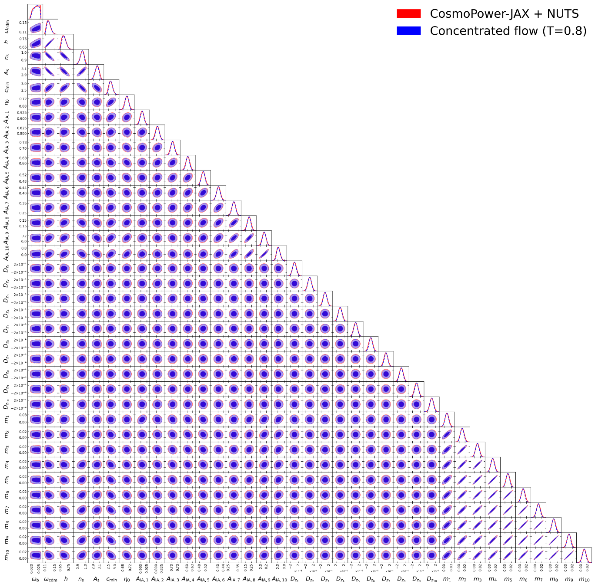{width=3.0cm}

\vspace{-0.6cm}

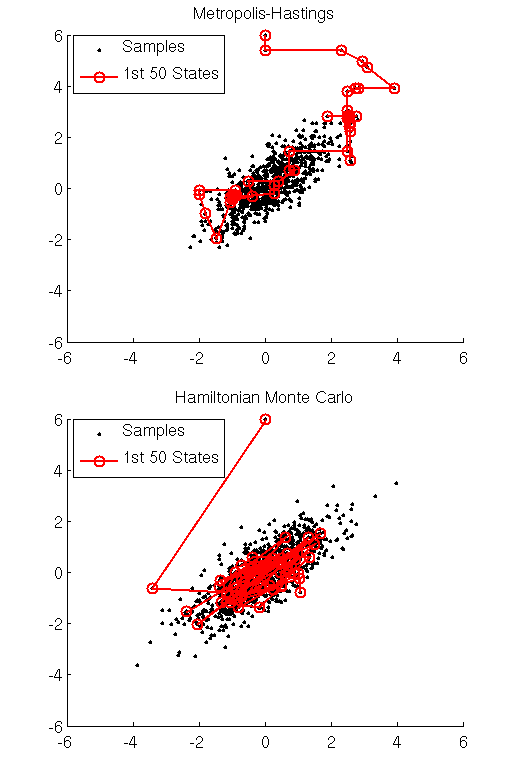{width=3.4cm}

:::
::::::

# What is an Einstein–Boltzmann code?

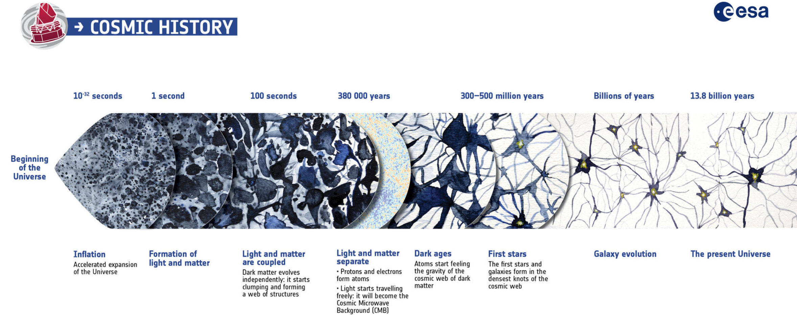{width=95%}

- Simulates universe described by some **cosmological model**
  (gravity, baryons, photons, neutrinos, dark matter & energy, ...).

- Perturbative around a homo. & iso. background universe.

- Main modeling tool for theoretical predictions $↔$ fit to data.

- Standard codes: **CAMB** (Fortran) & **CLASS** (C), 30-50k LOC.

# What do Einstein–Boltzmann codes compute?

:::::::::::::: {.columns align=center}
::: {.column width="33%"}

:::
::: {.column width="33%"}

:::
::: {.column width="33%"}

:::
::::::::::::::
:::::::::::::: {.columns align=center}
::: {.column width="33%"}

:::
::: {.column width="33%"}

:::
::: {.column width="33%"}

:::
::::::::::::::

\scriptsize

:::::::::::::: {.columns align=center}
::: {.column width="33%"}
- Must be accurate
:::
::: {.column width="33%"}
- Must be fast
:::
::: {.column width="33%"}
- Must be modifiable
:::
::::::::::::::

# Which equations do Einstein–Boltzmann codes solve?

\footnotesize
:::::::::::::: {.columns align=center}
::: {.column width="40%"}
\centering
**Background/thermodynamics:**
:::
::: {.column width="60%"}
\centering
**Perturbations:**
:::
::::::::::::::

\tiny
:::::::::::::: {.columns align=center}
::: {.column width="40%"}
\begin{align*}
a^\prime &= \bigg(\frac{8\pi}{3} \sum_s \rho_s\bigg)^\frac12 \, a^2 \\
\mathscr{H} &= \frac{a^\prime}{a} \\
\rho_s^\prime &= -3 \mathscr{H} (1+w_s) \rho_s \\
P_s &= w_s \rho_s \\
X_\text{H}^{+\prime} &= a C \left [\beta(T_b) (1\!-\!X_H^+) - n_H \alpha(T_b) (X_H^+)^2 \right] \\
c_s^2 &= \frac{k_B}{\mu c^2} \bigg( T_b - \frac{T_b^\prime}{3\mathscr{H}} \bigg) \\
T_\gamma &= \frac{T_{\gamma 0}}{a} \\
T_b^\prime &= - 2 \mathscr{H} {T_b} - \frac{8a}{3H_0} \frac{ T_\gamma^{4} {X_\text{e}}}{1 + {f_\text{He}} + {X_\text{e}}} \big(T_b\!-\!T_\gamma\big) \\
\kappa &= -\int_{\tau_0}^\tau \frac{a}{H_0} n_\text{e} \sigma_T c \, \mathrm{d}\tau \\
&\cdots
\end{align*}
:::
::: {.column width="60%"}
\begin{align*}
\Phi^\prime &= - \mathscr{H} \Psi - \frac{k^{2}}{3 \mathscr{H}} \Phi - \frac{4\pi}{3} \frac{a^{2} }{\mathscr{H}} \sum_s \delta_s \rho_s \\
\Psi &= - \Phi - 12\pi \bigg( \frac{a}{k} \bigg)^2 \sum_s (\rho_s + P_s)\sigma_s \\
\delta_s^\prime &= -(1+w_s)(θ_s-3Φ^\prime) - 3\mathscr{H}(cₛ²-w_s)δ_s \\
\theta_s^\prime &= -ℋ(1\!-\!3w_s)θ_s - \frac{w^\prime}{1\!+\!w_s} θ_s + \frac{k^2 cₛ²}{1\!+\!w_s} δ_s + k^2 (Ψ\!-\!σ_s) \\
F_0^\prime &= - k F_1 + 4 \Phi^\prime  \\
F_1^\prime &= \frac{k}{3} \big( F_0 - 2 F_2 + 4 \Psi \big) + \frac{4}{3} \frac{\kappa^\prime}{k} \big( \theta_\gamma - {\theta_b} \big) \\
F_l^\prime &= \frac{k}{2l+1} \big( l F_{l-1} - (l+1) F_{l+1} \big) + F_{l} {\kappa^\prime} - \delta_{l,2}\frac{\kappa^\prime}{10} \Pi \\
F_{l_\text{max}}^\prime &= k F_{l_\text{max}-1} - \frac{l_\text{max}+1}{\tau} F_{l_\text{max}} + {\kappa^\prime} F_{l_\text{max}}  \\
&\cdots
\end{align*}
:::
::::::::::::::

\footnotesize

- A lot of ordinary differential equations (ODEs).

# Why create another Einstein–Boltzmann code?

 

\small
**CAMB** and **CLASS** are very well-made codes, but:

- are complicated and hard to modify,

- use model-dependent approximations for speed and stability,

- can output gradients only through finite differences.

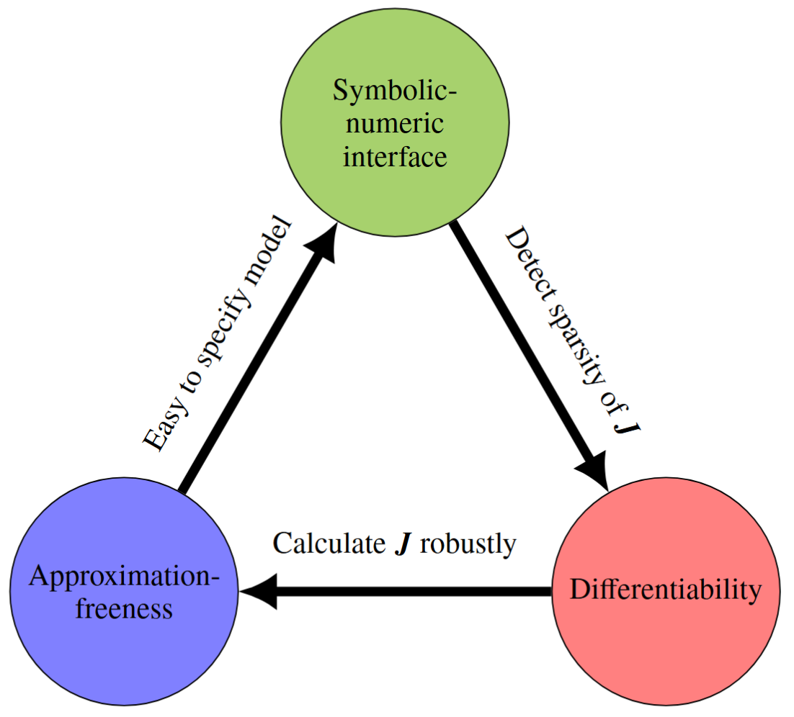{height=4cm}

# Feature 1: symbolic-numeric interface

\footnotesize

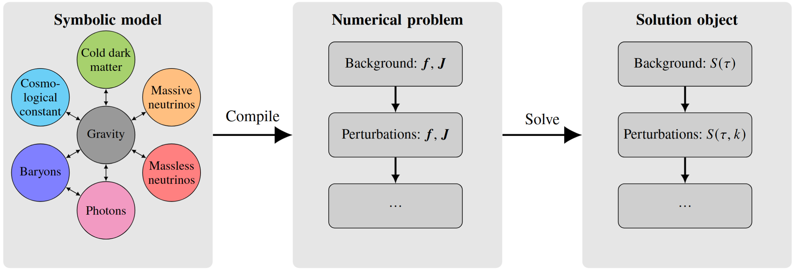

- SymBoltz represents equations **symbolically**:
  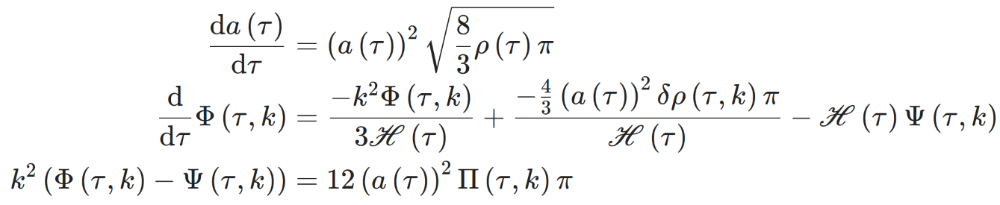{width=80%}

- Generates code for ODEs $\frac{\mathrm{d}\mathbf{u}}{\mathrm{d}τ} = \mathbf{f}(\mathbf{u},\mathbf{p},τ)$ and Jacobians $J_{ij} = \frac{\partial f_i}{\partial u_j}$

- Built on [ModelingToolkit.jl](https://github.com/SciML/ModelingToolkit.jl) (think SymPy, but more simulation-focused)

- **Goal:** use this for max. convenience/speed/stability with min. user input

# Interactive model--problem--solution workflow {.allowframebreaks}

\centering
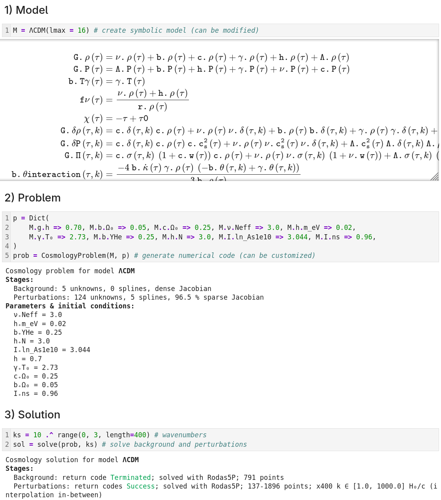{height=85%}

\framebreak

\tiny 

\vspace{-0.7cm}

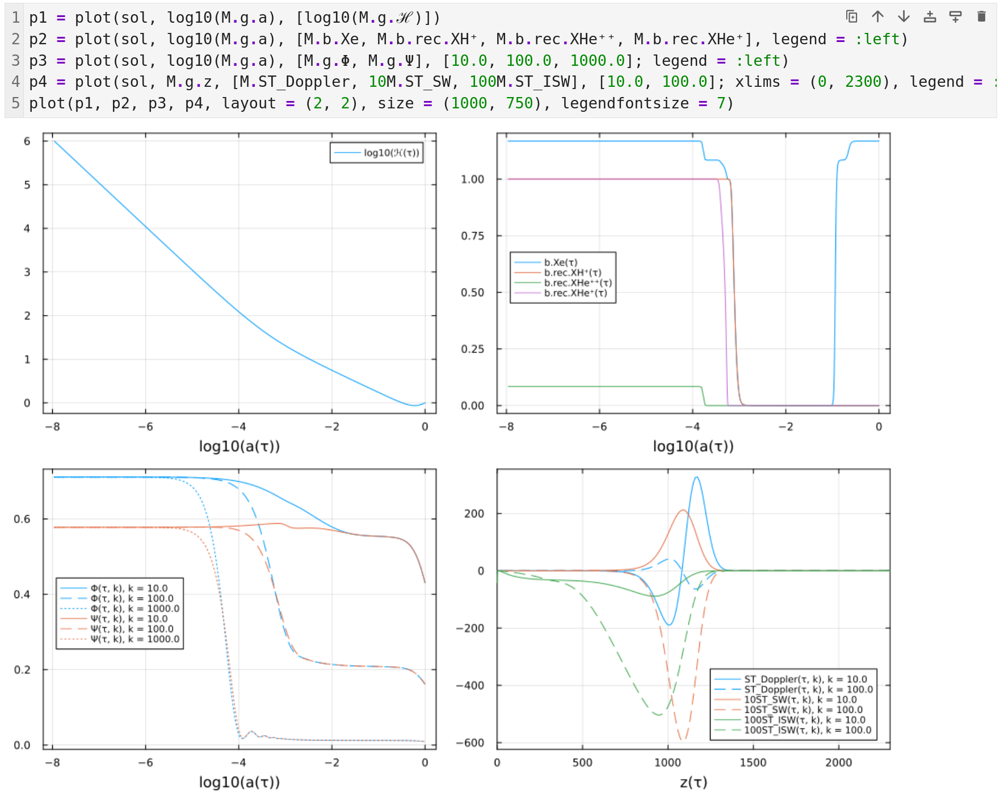{height=78%}

\framebreak

\tiny 

\vspace{-0.7cm}

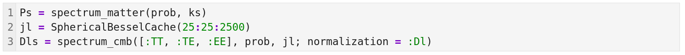{width=88%}

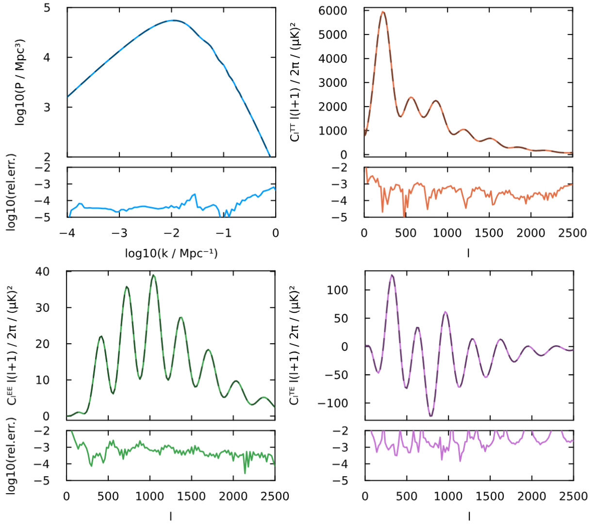{width=65%}


# Example: modify $Λ$ to $w₀wₐ$ dark energy

Implement equations from [1002.1311](https://arxiv.org/abs/1002.1311) in **CLASS** vs. **SymBoltz**:
$$
\begin{aligned}
w &= \frac{P}{\rho} = w_0 + w_a (1-a), \\
\rho &= ρ₀ a^{-3 (1 + w_0 + w_a)} e^{-3 w_a (1-a)}, \\
cₐ² &= w - \frac{1}{3ℋ(1+w)} \frac{\mathrm{d}w}{\mathrm{d}τ}, \\
\frac{\mathrm{d}\delta}{\mathrm{d}\tau} &= 3ℋ(w-c_s^2)δ - \Big(1+w\Big)\Big(\Big(1+9\Big(\frac{ℋ}{k}\Big)^2(c_s^2-c_a^2)\Big)θ - 3\frac{\mathrm{d}Φ}{\mathrm{d}τ}\Big), \\
\frac{\mathrm{d}θ}{\mathrm{d}τ} &= ℋ(3cₛ²-1)θ + \frac{k^2 cₛ² δ}{1+w} + k^2 Ψ, \\
\sigma &= 0. \\
\end{aligned}
$$

# Long modification to CLASS {.allowframebreaks}

\footnotesize
[Official advice](https://lesgourg.github.io/class-tour/Padova/CLASS_Padova_Coding.pdf): Search for "`_fld`" in `include/`, `source/`, `python/`:

1. Read input parameters and handle parameter dependencies:

\tiny
```
input.c:3177:  class_call(parser_read_double(pfc,"Omega_fld",&param2,&flag2,errmsg),
input.c:3186:             "'Omega_Lambda' or 'Omega_fld' must be left unspecified, except if 'Omega_scf' is set and < 0.");
input.c:3189:             "You have entered 'Omega_scf' < 0 , so you have to specify both 'Omega_lambda' and 'Omega_fld'.");
input.c:3215:    pba->Omega0_fld = param2;
input.c:3216:    Omega_tot += pba->Omega0_fld;
input.c:3232:    pba->Omega0_fld = 1. - pba->Omega0_k - Omega_tot;
input.c:3234:      printf(" -> matched budget equations by adjusting Omega_fld = %g\n",pba->Omega0_fld);
input.c:3248:  if (pba->Omega0_fld != 0.) {
input.c:3285:      class_read_double("w0_fld",pba->w0_fld);
input.c:3286:      class_read_double("wa_fld",pba->wa_fld);
input.c:3287:      class_read_double("cs2_fld",pba->cs2_fld);
input.c:3292:      class_read_double("w0_fld",pba->w0_fld);
input.c:3294:      class_read_double("cs2_fld",pba->cs2_fld);
```

\footnotesize
2. Add parameter hooks to Python wrapper, too:

\tiny
```
cclassy.pxd:91:        double Omega0_fld
cclassy.pxd:92:        double w0_fld
cclassy.pxd:93:        double wa_fld
cclassy.pxd:94:        double cs2_fld
```

\framebreak

\footnotesize
3. Declare background variables and indices:

\tiny
```
background.h:104:  double Omega0_fld;       /**< \f$ \Omega_{0 de} \f$: fluid */
background.h:110:  double w0_fld;   /**< \f$ w0_{DE} \f$: current fluid equation of state parameter */
background.h:111:  double wa_fld;   /**< \f$ wa_{DE} \f$: fluid equation of state parameter derivative */
background.h:112:  double cs2_fld;  /**< \f$ c^2_{s~DE} \f$: sound speed of the fluid in the frame comoving with the fluid (so, this is
background.h:169:  int index_bg_rho_fld;       /**< fluid density */
background.h:170:  int index_bg_w_fld;         /**< fluid equation of state */
background.h:257:  int index_bi_rho_fld; /**< {B} fluid density */
background.h:289:  short has_fld;       /**< presence of fluid with constant w and cs2? */
background.h:416:  int background_w_fld(
background.h:419:                       double * w_fld,
background.h:420:                       double * dw_over_da_fld,
background.h:421:                       double * integral_fld);
```

\footnotesize
4. Compute background:

\tiny
```
background.c:398:  double w_fld, dw_over_da, integral_fld;
background.c:540:  if (pba->has_fld == _TRUE_) {
background.c:542:    /* get rho_fld from vector of integrated variables */
background.c:543:    pvecback[pba->index_bg_rho_fld] = pvecback_B[pba->index_bi_rho_fld];
background.c:545:    /* get w_fld from dedicated function */
background.c:546:    class_call(background_w_fld(pba,a,&w_fld,&dw_over_da,&integral_fld), pba->error_message, pba->error_message);
background.c:547:    pvecback[pba->index_bg_w_fld] = w_fld;
background.c:550:    // pvecback[pba->index_bg_rho_fld] = pba->Omega0_fld * pow(pba->H0,2) / pow(a,3.*(1.+pba->w0_fld+pba->wa_fld)) * exp(3.*pba->wa_fld*(a-1.));
background.c:551:    // But now everthing is integrated numerically for a given w_fld(a) defined in the function background_w_fld.
background.c:553:    rho_tot += pvecback[pba->index_bg_rho_fld];
background.c:554:    p_tot += w_fld * pvecback[pba->index_bg_rho_fld];
background.c:555:    dp_dloga += (a*dw_over_da-3*(1+w_fld)*w_fld)*pvecback[pba->index_bg_rho_fld];
background.c:664:int background_w_fld(
background.c:667:                     double * w_fld,
background.c:668:                     double * dw_over_da_fld,
background.c:669:                     double * integral_fld
background.c:680:    *w_fld = pba->w0_fld + pba->wa_fld * (1. - a);
background.c:715:    *dw_over_da_fld = - pba->wa_fld;
background.c:738:    *integral_fld = 3.*((1.+pba->w0_fld+pba->wa_fld)*log(1./a) + pba->wa_fld*(a-1.));
background.c:985:  pba->has_fld = _FALSE_;
background.c:1012:  if (pba->Omega0_fld != 0.)
background.c:1013:    pba->has_fld = _TRUE_;
background.c:1080:  class_define_index(pba->index_bg_rho_fld,pba->has_fld,index_bg,1);
background.c:1081:  class_define_index(pba->index_bg_w_fld,pba->has_fld,index_bg,1);
background.c:1166:  class_define_index(pba->index_bi_rho_fld,pba->has_fld,index_bi,1);
background.c:1744:  double w_fld, dw_over_da, integral_fld;
background.c:1778:  if (pba->has_fld == _TRUE_) {
background.c:1780:    class_call(background_w_fld(pba,0.,&w_fld,&dw_over_da,&integral_fld), pba->error_message, pba->error_message);
background.c:1782:    class_test(w_fld >= 1./3.,
background.c:1785:               w_fld);
background.c:2150:  double rho_fld_today;
background.c:2151:  double w_fld,dw_over_da_fld,integral_fld;
background.c:2240:  if (pba->has_fld == _TRUE_) {
background.c:2242:    /* rho_fld today */
background.c:2243:    rho_fld_today = pba->Omega0_fld * pow(pba->H0,2);
background.c:2245:    /* integrate rho_fld(a) from a_ini to a_0, to get rho_fld(a_ini) given rho_fld(a0) */
background.c:2246:    class_call(background_w_fld(pba,a,&w_fld,&dw_over_da_fld,&integral_fld), pba->error_message, pba->error_message);
background.c:2254:    /* rho_fld at initial time */
background.c:2255:    pvecback_integration[pba->index_bi_rho_fld] = rho_fld_today * exp(integral_fld);
background.c:2453:  class_store_columntitle(titles,"(.)rho_fld",pba->has_fld);
background.c:2454:  class_store_columntitle(titles,"(.)w_fld",pba->has_fld);
background.c:2526:    class_store_double(dataptr,pvecback[pba->index_bg_rho_fld],pba->has_fld,storeidx);
background.c:2527:    class_store_double(dataptr,pvecback[pba->index_bg_w_fld],pba->has_fld,storeidx);
background.c:2652:  if (pba->has_fld == _TRUE_) {
background.c:2654:    dy[pba->index_bi_rho_fld] = -3.*(1.+pvecback[pba->index_bg_w_fld])*y[pba->index_bi_rho_fld];
```

\footnotesize
5. Declare perturbation variables:

\tiny
```
perturbations.h:247:  short has_source_delta_fld;  /**< do we need source for delta of dark energy? */
perturbations.h:261:  short has_source_theta_fld;  /**< do we need source for theta of dark energy? */
perturbations.h:294:  int index_tp_delta_fld;  /**< index value for delta of dark energy */
perturbations.h:310:  int index_tp_theta_fld;   /**< index value for theta of dark energy */
perturbations.h:478:  int index_pt_delta_fld;  /**< dark energy density in true fluid case */
perturbations.h:479:  int index_pt_theta_fld;  /**< dark energy velocity in true fluid case */
```

\footnotesize
6. Compute perturbations:

\tiny
```
perturbations.c:472:          class_store_double(dataptr,tk[ppt->index_tp_delta_fld],ppt->has_source_delta_fld,storeidx);
perturbations.c:501:          class_store_double(dataptr,tk[ppt->index_tp_theta_fld],ppt->has_source_theta_fld,storeidx);
perturbations.c:560:      class_store_columntitle(titles,"d_fld",pba->has_fld);
perturbations.c:589:      class_store_columntitle(titles,"t_fld",pba->has_fld);
perturbations.c:712:  double w_fld_ini, w_fld_0,dw_over_da_fld,integral_fld;
perturbations.c:1187:  ppt->has_source_delta_fld = _FALSE_;
perturbations.c:1202:  ppt->has_source_theta_fld = _FALSE_;
perturbations.c:1294:        if (pba->has_fld == _TRUE_)
perturbations.c:1295:          ppt->has_source_delta_fld = _TRUE_;
perturbations.c:1325:        if (pba->has_fld == _TRUE_)
perturbations.c:1326:          ppt->has_source_theta_fld = _TRUE_;
perturbations.c:1401:      class_define_index(ppt->index_tp_delta_fld,  ppt->has_source_delta_fld, index_type,1);
perturbations.c:1415:      class_define_index(ppt->index_tp_theta_fld,  ppt->has_source_theta_fld, index_type,1);
perturbations.c:3360:      class_store_columntitle(ppt->scalar_titles, "delta_rho_fld", pba->has_fld);
perturbations.c:3361:      class_store_columntitle(ppt->scalar_titles, "rho_plus_p_theta_fld", pba->has_fld);
perturbations.c:3362:      class_store_columntitle(ppt->scalar_titles, "delta_p_fld", pba->has_fld);
perturbations.c:3941:      class_define_index(ppv->index_pt_delta_fld,pba->has_fld,index_pt,1); /* fluid density */
perturbations.c:3942:      class_define_index(ppv->index_pt_theta_fld,pba->has_fld,index_pt,1); /* fluid velocity */
perturbations.c:4402:      if (pba->has_fld == _TRUE_) {
perturbations.c:4405:          ppv->y[ppv->index_pt_delta_fld] =
perturbations.c:4406:            ppw->pv->y[ppw->pv->index_pt_delta_fld];
perturbations.c:4408:          ppv->y[ppv->index_pt_theta_fld] =
perturbations.c:4409:            ppw->pv->y[ppw->pv->index_pt_theta_fld];
perturbations.c:5281:  double w_fld,dw_over_da_fld,integral_fld;
perturbations.c:5458:      if (pba->has_fld == _TRUE_) {
perturbations.c:5460:        class_call(background_w_fld(pba,a,&w_fld,&dw_over_da_fld,&integral_fld), pba->error_message, ppt->error_message);
perturbations.c:5463:          ppw->pv->y[ppw->pv->index_pt_delta_fld] = - ktau_two/4.*(1.+w_fld)*(4.-3.*pba->cs2_fld)/(4.-6.*w_fld+3.*pba->cs2_fld) * ppr->curvature_ini * s2_squared; /* from 1004.5509 */ //TBC: curvature
perturbations.c:5465:          ppw->pv->y[ppw->pv->index_pt_theta_fld] = - k*ktau_three/4.*pba->cs2_fld/(4.-6.*w_fld+3.*pba->cs2_fld) * ppr->curvature_ini * s2_squared; /* from 1004.5509 */ //TBC:curvature
perturbations.c:5740:      if ((pba->has_fld == _TRUE_) && (pba->use_ppf == _FALSE_)) {
perturbations.c:5742:        class_call(background_w_fld(pba,a,&w_fld,&dw_over_da_fld,&integral_fld), pba->error_message, ppt->error_message);
perturbations.c:5744:        ppw->pv->y[ppw->pv->index_pt_delta_fld] -= 3*(1.+w_fld)*a_prime_over_a*alpha;
perturbations.c:5745:        ppw->pv->y[ppw->pv->index_pt_theta_fld] += k*k*alpha;
perturbations.c:6719:  double w_fld,dw_over_da_fld,integral_fld;
perturbations.c:6727:  double w_prime_fld, ca2_fld;
perturbations.c:6730:  double rho_fld, p_fld, rho_fld_prime, p_fld_prime;
perturbations.c:6732:  double Gamma_fld, S, S_prime, theta_t, theta_t_prime, rho_plus_p_theta_fld_prime;
perturbations.c:7109:    if (pba->has_fld == _TRUE_) {
perturbations.c:7111:      class_call(background_w_fld(pba,a,&w_fld,&dw_over_da_fld,&integral_fld), pba->error_message, ppt->error_message);
perturbations.c:7112:      w_prime_fld = dw_over_da_fld * a_prime_over_a * a;
perturbations.c:7115:        ppw->delta_rho_fld = ppw->pvecback[pba->index_bg_rho_fld]*y[ppw->pv->index_pt_delta_fld];
perturbations.c:7116:        ppw->rho_plus_p_theta_fld = (1.+w_fld)*ppw->pvecback[pba->index_bg_rho_fld]*y[ppw->pv->index_pt_theta_fld];
perturbations.c:7117:        ca2_fld = w_fld - w_prime_fld / 3. / (1.+w_fld) / a_prime_over_a;
perturbations.c:7119:        ppw->delta_p_fld = pba->cs2_fld * ppw->delta_rho_fld + (pba->cs2_fld-ca2_fld)*(3*a_prime_over_a*ppw->rho_plus_p_theta_fld/k/k);
perturbations.c:7387:  double w_fld,dw_over_da_fld,integral_fld;
perturbations.c:7787:    /* delta_fld */
perturbations.c:7788:    if (ppt->has_source_delta_fld == _TRUE_) {
perturbations.c:7789:      _set_source_(ppt->index_tp_delta_fld) = ppw->delta_rho_fld/pvecback[pba->index_bg_rho_fld]
perturbations.c:7790:        + 3.*a_prime_over_a*(1.+pvecback[pba->index_bg_w_fld])*theta_over_k2; // N-body gauge correction
perturbations.c:7903:    /* theta_fld */
perturbations.c:7904:    if (ppt->has_source_theta_fld == _TRUE_) {
perturbations.c:7906:      class_call(background_w_fld(pba,a,&w_fld,&dw_over_da_fld,&integral_fld), pba->error_message, ppt->error_message);
perturbations.c:7908:      _set_source_(ppt->index_tp_theta_fld) = ppw->rho_plus_p_theta_fld/(1.+w_fld)/pvecback[pba->index_bg_rho_fld]
perturbations.c:8472:    class_store_double(dataptr, ppw->delta_rho_fld, pba->has_fld, storeidx);
perturbations.c:8473:    class_store_double(dataptr, ppw->rho_plus_p_theta_fld, pba->has_fld, storeidx);
perturbations.c:8474:    class_store_double(dataptr, ppw->delta_p_fld, pba->has_fld, storeidx);
perturbations.c:8683:  double w_fld,dw_over_da_fld,w_prime_fld,integral_fld;
perturbations.c:9269:    if (pba->has_fld == _TRUE_) {
perturbations.c:9276:        class_call(background_w_fld(pba,a,&w_fld,&dw_over_da_fld,&integral_fld), pba->error_message, ppt->error_message);
perturbations.c:9277:        w_prime_fld = dw_over_da_fld * a_prime_over_a * a;
perturbations.c:9279:        ca2 = w_fld - w_prime_fld / 3. / (1.+w_fld) / a_prime_over_a;
perturbations.c:9280:        cs2 = pba->cs2_fld;
perturbations.c:9284:        dy[pv->index_pt_delta_fld] =
perturbations.c:9285:          -(1+w_fld)*(y[pv->index_pt_theta_fld]+metric_continuity)
perturbations.c:9286:          -3.*(cs2-w_fld)*a_prime_over_a*y[pv->index_pt_delta_fld]
perturbations.c:9287:          -9.*(1+w_fld)*(cs2-ca2)*a_prime_over_a*a_prime_over_a*y[pv->index_pt_theta_fld]/k2;
perturbations.c:9291:        dy[pv->index_pt_theta_fld] = /* fluid velocity */
perturbations.c:9292:          -(1.-3.*cs2)*a_prime_over_a*y[pv->index_pt_theta_fld]
perturbations.c:9293:          +cs2*k2/(1.+w_fld)*y[pv->index_pt_delta_fld]
```

\normalsize

- Scattered over many places.

- A lot of unnecessary boilerplate code.

# Short modification to SymBoltz

\tiny
```julia
# 1) Create w0wa species "X"
g, τ, k = M.g, M.τ, M.k
a, ℋ, Φ, Ψ = g.a, g.ℋ, g.Φ, g.Ψ
D = Differential(τ)
@parameters w₀ wₐ cₛ² Ω₀ ρ₀
@variables ρ(τ) P(τ) w(τ) cₐ²(τ) δ(τ, k) θ(τ, k) σ(τ, k)
eqs = [
  w ~ w₀ + wₐ*(1-a)
  ρ₀ ~ 3*Ω₀ / (8*Num(π))
  ρ ~ ρ₀ * a^(-3(1+w₀+wₐ)) * exp(-3wₐ*(1-a))
  P ~ w * ρ
  cₐ² ~ w - 1/(3ℋ) * D(w)/(1+w)
  D(δ) ~ 3ℋ*(w-cₛ²)*δ - (1+w)*((1+9(ℋ/k)^2*(cₛ²-cₐ²))*θ - 3*D(Φ))
  D(θ) ~ (3cₛ²-1)*ℋ*θ + k^2*cₛ²*δ/(1+w) + k^2*Ψ
  σ ~ 0
]
initialization_eqs = [
  δ ~ -3//2 * (1+w) * Ψ
  θ ~ 1//2 * (k^2*τ) * Ψ
]
X = System(eqs, τ; initialization_eqs, name = :X)

# 2) Create new symbolic w0waCDM model
M = ΛCDM(Λ = X, lmax = 16, name = :w₀wₐCDM)

# 3) Create new numerical problem
push!(p, X.w₀ => -0.9, X.wₐ => 0.2, X.cₛ² => 1.0)
prob = CosmologyProblem(M, p)
```

\normalsize

- Everything in one place.

- Symbolic engine automates chores.

# Feature 2: approximation-freeness

\footnotesize
**Problem:** Full equations are *stiff* due to different (inverse) \textcolor{red}{time scales}, e.g.:
$$\frac{\mathrm{d} θ_b}{\mathrm{d}τ} = -\textcolor{red}{ℋ} θ_b + \textcolor{red}{k^2} (cₛ² δ_b + \Psi) + R \textcolor{red}{\tau_c^{-1}} Θ_{γb}, \qquad Θ_{γb} = θ_γ - θ_b$$

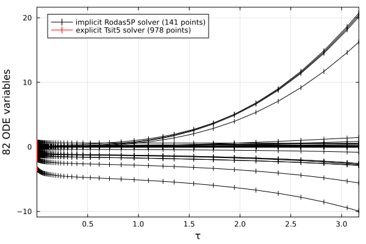{width=75%}

# Solution A: remove stiffness with approximation schemes

:::::::::::::: {.columns}
::: {.column width="64%"}

 

Approx. equations in various regimes, e.g.:

\vspace{0.2cm}

- tight coupling (TCA)

- radiation streaming (RSA)

- ultra-relativistic fluid (UFA)

- non-cold dark matter fluid (NCDMFA)

- Saha approximation

:::
::: {.column width="36%"}
)](media/approximations.png){height=40%}
:::
::::::::::::::

\vspace{-0.7cm}

\tiny
$$Θ_{γb}^\prime \stackrel{\text{TCA}}{≈} \bigg( \frac{\tau_c^\prime}{\tau} Θ_{γb} - \frac{2 \mathscr{H}}{1 + R} \bigg) - \frac{τ_c}{1+R} \bigg[ -\frac{a^{\prime\prime}}{a} θ_b + k^2 \bigg( -\frac{\mathscr{H}}{2} δ_γ + \bar{c}_s^2 δ_b + c_s^2 δ_b^\prime - \frac14 \delta_\gamma^\prime \bigg) \bigg] \quad \bigg(\text{if } \frac{\tau_c}{k^{-1}},\frac{\tau_c}{\tau} \ll 1\bigg)$$

\vspace{-0.3cm}

\normalsize

- Increases speed and stability. Can use explicit methods.

- **Complicated!** Derive $→$ validate $→$ tune switching criteria.

- Extensions reintroduce stiffness $→$ need new approximations.

- Biases extensions to less complicated sectors of ΛCDM?

# Solution B: solve full stiff equations with implicit methods {.allowframebreaks}

- Methods designed for stiff equations. Simplest example:
  $$
  \begin{aligned}
  \text{Explicit Euler method: } \textcolor{red}{\mathbf{u}_{n+1}} &= \mathbf{u}_n + h \, \mathbf{f}(\mathbf{u}_n), \\
  \text{Implicit Euler method: } \textcolor{red}{\mathbf{u}_{n+1}} &= \mathbf{u}_n + h \, \mathbf{f}(\textcolor{red}{\mathbf{u}_{n+1}}).
  \end{aligned}
  $$

- **Problem:** At every time step, implicit solvers must solve:
  $$\mathbf{F}(\textcolor{red}{\mathbf{u}}) = \textcolor{red}{\mathbf{u}} - h \mathbf{f}(\textcolor{red}{\mathbf{u}}) - \mathbf{u}_n = \mathbf{0}.$$

  - Slow and hard to implement, e.g. iterate with Newton's method.

  - Need ODE Jacobian $\mathbf{J} = \frac{\partial f_i}{\partial u_j}$ and $\mathbf{F}$'s Jacobian $\mathbf{W} = \mathbf{I} - h \mathbf{J}$.

    - Hard to specify analytically for the user.

    - Finite differences is approximate and need $N$ calls to $\mathbf{f}$.

\framebreak

- **Solution:** Use symbolic eqs. to generate analytical & sparse $\mathbf{J}$:

  - Automatic: user only has to specify $\mathbf{f}$.

  - Faster: evaluate $J_{ij}$ and store them directly in a sparse matrix.

  - Faster: sparse matrix makes solving $\mathbf{F}(\mathbf{u}) = \mathbf{0}$ faster.

\tiny 

:::::: {.columns}
::: {.column width=40%}

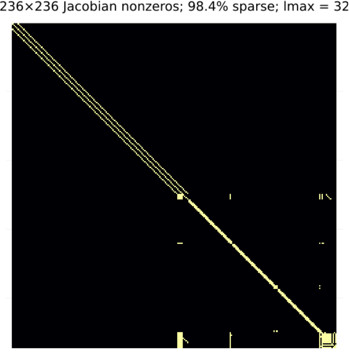{}

:::
::: {.column width=60%}

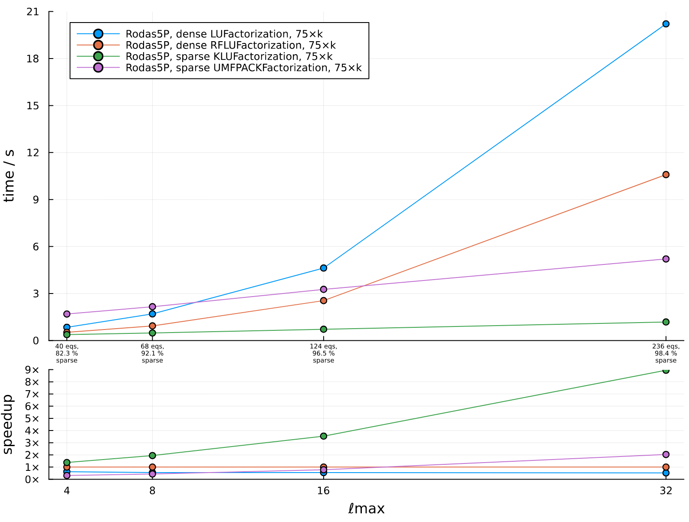

:::
::::::

# Reward: no approximations *really* simplifies the code

\footnotesize

\vspace{0.2cm}

:::::::::::::: {.columns}
::: {.column width="50%"}

\centering
**CLASS** (with RSA and UFA):

\vspace{0.1cm}

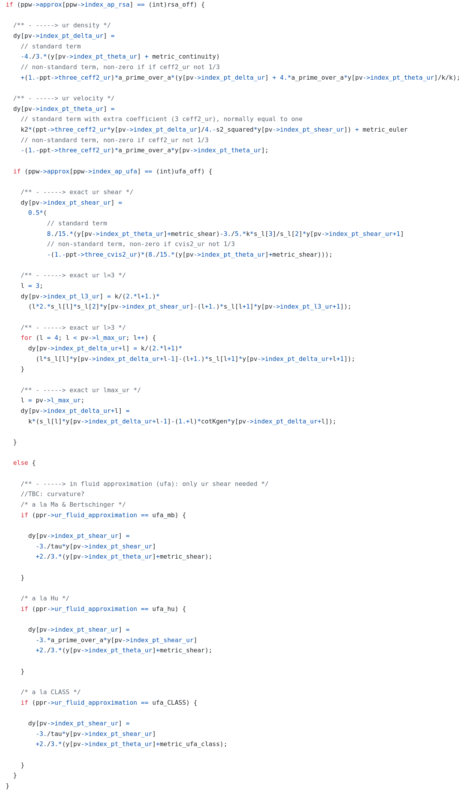{width=85%}
:::
::: {.column width="50%"}

\centering
**SymBoltz** (same equations):

\vspace{0.1cm}

\fontsize{4pt}{4pt}\selectfont
```julia
D(Fν0) ~ -k*Fν[1] + 4*D(Φ)
D(Fν[1]) ~ k/3*(Fν0-2Fν[2]+4Ψ)
[D(Fν[l]) ~ k/(2l+1) * (l*Fν[l-1] - (l+1)*Fν[l+1]) for l in 2:lνmax-1]...
D(Fν[lνmax]) ~ k*Fν[lνmax-1] - (lνmax+1) / τ * Fν[lνmax]
δν ~ Fν0
θν ~ 3k*Fν[1]/4
σν ~ Fν[2]/2
```

\footnotesize

\vspace{4.0cm}

- **SymBoltz:** [ΛCDM model](https://hersle.github.io/SymBoltz.jl/stable/LCDM/) in 277 lines of code in only 1 file.

- **CLASS:** ΛCDM model spread over 27721 lines of code across 10 files.

:::
::::::::::::::

# Performance is very good

SymBoltz.jl + [OrdinaryDiffEq.jl](https://github.com/SciML/OrdinaryDiffEq.jl/) can test several implicit solvers:

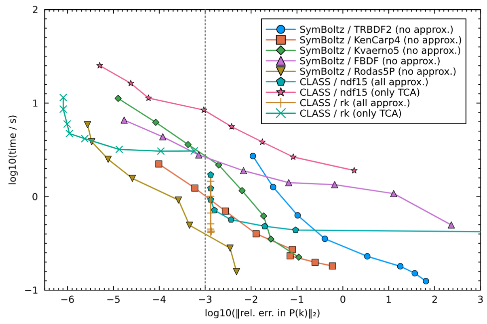{width=75%}

\vspace{-0.2cm}
\scriptsize

- 10$\times$ faster than CLASS with minimal approximations.

- But line-of-sight integration for $C_l$ is currently slower than in CLASS.

# Comparison of approximation/performance characteristics

\tiny
\setlength{\tabcolsep}{2pt}
\def\arraystretch{1.5}

                           CAMB                  CLASS                                 PyCosmo                       DISCO-EB                            Bolt${}^1$                          SymBoltz
-------------------------- -------------------   ---------------------------------     --------------------          --------------------                --------------------                ---------------------
Best implicit solver       \cellcolor{red}None   \cellcolor{green}`ndf15`              \cellcolor{green}`BDF2`       \cellcolor{green}`Kvaerno5`         \cellcolor{green}`KenCarp4`         \cellcolor{green}`Rodas5P`
Approximation-free         \cellcolor{red}No     \cellcolor{yellow}Almost${}^2$        \cellcolor{green}Yes          \cellcolor{green}Yes                \cellcolor{green}Yes                \cellcolor{green}Yes
Solver order (stable)      6                     \cellcolor{yellow}1-5 (2)${}^3$       \cellcolor{yellow}2 (2)       \cellcolor{green}5 (5)              \cellcolor{green}4 (4)              \cellcolor{green}5 (5)
Newton iterations          Not needed            \cellcolor{red}Yes                    \cellcolor{green}No${}^4$     \cellcolor{red}Yes                  \cellcolor{red}Yes                  \cellcolor{green}No${}^5$
Jacobian method            Not needed            \cellcolor{red}$O(N)$ fin.diff.       \cellcolor{green}$O(1)$ anal. \cellcolor{yellow}$O(N)$ auto.diff. \cellcolor{yellow}$O(N)$ auto.diff. \cellcolor{green}$O(1)$ anal.
Jacobian sparsity          Not needed            \cellcolor{yellow}Changes${}^6$       \cellcolor{green}Fixed        \cellcolor{red}Not supported        \cellcolor{red}Not supported        \cellcolor{green}Fixed
Differentiable             \cellcolor{red}{No}   \cellcolor{red}No                     \cellcolor{red}No             \cellcolor{green}Yes                \cellcolor{green}Yes                \cellcolor{green}Yes  

- ${}^1$Development seems to have stopped.

- ${}^2$[Tight-coupling approximation is mandatory](https://github.com/lesgourg/class_public/blob/e85808324f51fc694d12e3ed7439552a3c3f9540/include/perturbations.h#L42), but others can be disabled.

- ${}^3$BDF methods are "A-stable" and "L-stable" only to 2nd order (e.g. [doi.org/10.1137/S1064827594276424](https://doi.org/10.1137/S1064827594276424)).

- ${}^4$Custom `BDF2` method specializing on linearity $\mathbf{f} = \mathbf{J} \mathbf{u}$ (see [1708.05177](https://arxiv.org/abs/1708.05177) eq. (21)).

- ${}^5$Rosenbrock methods linearize $\mathbf{f} = \mathbf{J} \mathbf{u}$ (e.g. [doi.org/10.1007/s10543-023-00967-x](https://doi.org/10.1007/s10543-023-00967-x)).

- ${}^6$Sparsity found numerically and changes with approximations.

# Feature 3: differentiability

:::::::::::::: {.columns}
::: {.column width="50%"}

Derivatives are important, e.g.:

 

- Gradient-based MCMCs (Hamiltonian Monte Carlo).

 

- Training machine learning emulators (minimize loss).

 

- Fisher forecasting.

 

- Sensitivity analysis: $∂(\mathrm{output}) / ∂(\mathrm{input})$.

 

- Shooting method in Einstein-Boltzmann codes.

:::
::: {.column width="50%"}

**Automatic differentiation** gives "exact" gradients from SymBoltz:

 

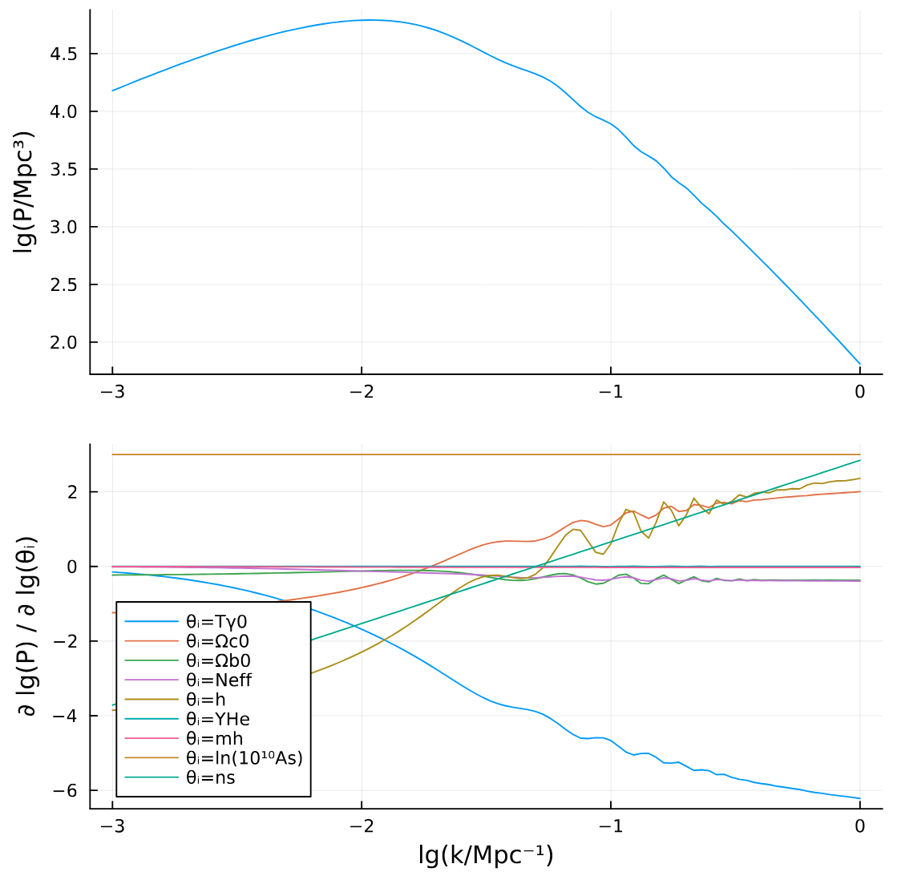

:::
::::::::::::::

# What is automatic differentiation? {.allowframebreaks}

:::::::::::::: {.columns}
::: {.column width="78%"}

Any computer program is a long function:
$$\mathbf{f} = \mathbf{f}_N(\mathbf{f}_{N-1}( \cdots \mathbf{f}_2(\mathbf{f}_1))).$$

Two ways to compute Jacobian $\mathbf{J} = \nabla \mathbf{f}$:

:::
::: {.column width="22%"}
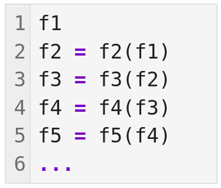
:::
::::::::::::::

\vspace{1.5cm}

:::::::::::::: {.columns}
::: {.column width="50%"}

\centering

**Finite differences:**
\small
$$J_{ij} ≈ \frac{[\symbf{f}(\symbf{x} + \frac12 \symbf{\epsilon}_j) - \symbf{f}(\symbf{x} - \frac12 \symbf{\epsilon}_j)]_i}{ϵ}$$
($\mathbf{f}$ is a black box)

:::
::: {.column width="50%"}

\centering

**Automatic differentiation:**
\small
$$\mathbf{J} = \frac{\partial\,\mathbf{f}_{N}}{\partial\,\mathbf{f}_{N-1}} \cdot \frac{\partial\,\mathbf{f}_{N-1}}{\partial\,\mathbf{f}_{N-2}} \cdots \frac{\partial\,\mathbf{f}_{3}}{\partial\,\mathbf{f}_{2}} \cdot \frac{\partial\,\mathbf{f}_{2}}{\partial\,\mathbf{f}_{1}}$$
(chain rule at every step)

:::
::::::::::::::

\framebreak

**AD systems** let you overload functions with chain rules in code:

\tiny

```julia
mysin(x) = (println("Hi it's me, sin($x)"); return sin(x))
mycos(x) = (println("Hi it's me, cos($x)"); return cos(x))
mytan(x) = (println("Hi it's me, tan($x)"); return mysin(x) / mycos(x))
f, x₀, ϵ = mytan, π/4, 1e-15
println("FD: tan′(π/4) ≈ ", (f(x₀+ϵ/2)-f(x₀-ϵ/2))/ϵ)

using ForwardDiff, ChainRulesCore, ForwardDiffChainRules
ChainRulesCore.frule((_, dx), ::typeof(mysin), x) = (mysin(x), +mycos(x) * dx) # (value, derivative)
ChainRulesCore.frule((_, dx), ::typeof(mycos), x) = (mycos(x), -mysin(x) * dx) # (value, derivative)
@ForwardDiff_frule mysin(x::ForwardDiff.Dual)
@ForwardDiff_frule mycos(x::ForwardDiff.Dual)
println("AD: tan′(π/4) = ", ForwardDiff.derivative(f, x₀))
```

 

\normalsize
Output:
\tiny

```
Hi it's me, tan(0.7853981633974488)        Hi it's me, tan(Dual{Float64}(0.7853981633974483,1.0))
Hi it's me, sin(0.7853981633974488)        Hi it's me, sin(0.7853981633974483)
Hi it's me, cos(0.7853981633974488)        Hi it's me, cos(0.7853981633974483)
Hi it's me, tan(0.7853981633974477)        Hi it's me, cos(0.7853981633974483)
Hi it's me, sin(0.7853981633974477)        Hi it's me, sin(0.7853981633974483)
Hi it's me, cos(0.7853981633974477)        AD: tan′(π/4) = 1.9999999999999996
FD: tan′(π/4) ≈ 2.220446049250313
```

 

\normalsize

- "Exact" derivatives without tuning $ϵ$

# SymBoltz' output can be differentiated

:::::: {.columns}
::: {.column width=62%}

Works for **Fisher forecasting**:

\small
$$\text{Needs }F_{ij} = -\frac12 \frac{\partial^2 \log L}{\partial p_i \partial p_j} = \sum_l \textcolor{red}{\frac{\partial C_l}{\partial p_i}} \frac{1}{\sigma_l^2} \textcolor{red}{\frac{\partial C_l}{\partial p_j}}$$

:::
::: {.column width=38%}

Works for simple **MCMC**:

\small
$$\text{Needs } \frac{\partial \log L}{\partial p_i} \phantom{\frac{\partial C_l}{\partial p_i}}$$

:::
::::::

 

:::::: {.columns}
::: {.column width=70%}

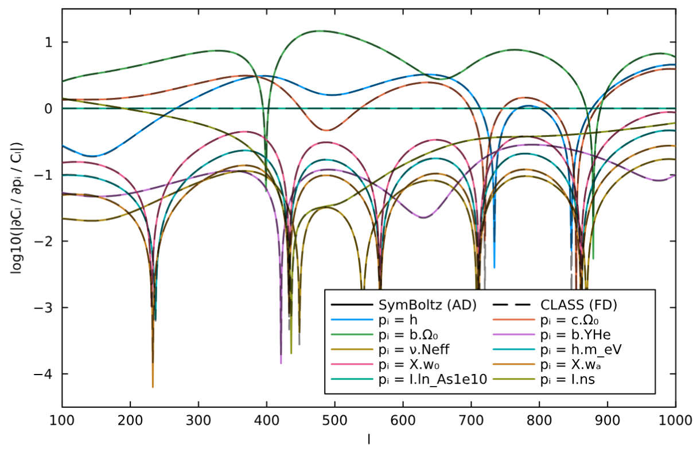{height=2.7cm}
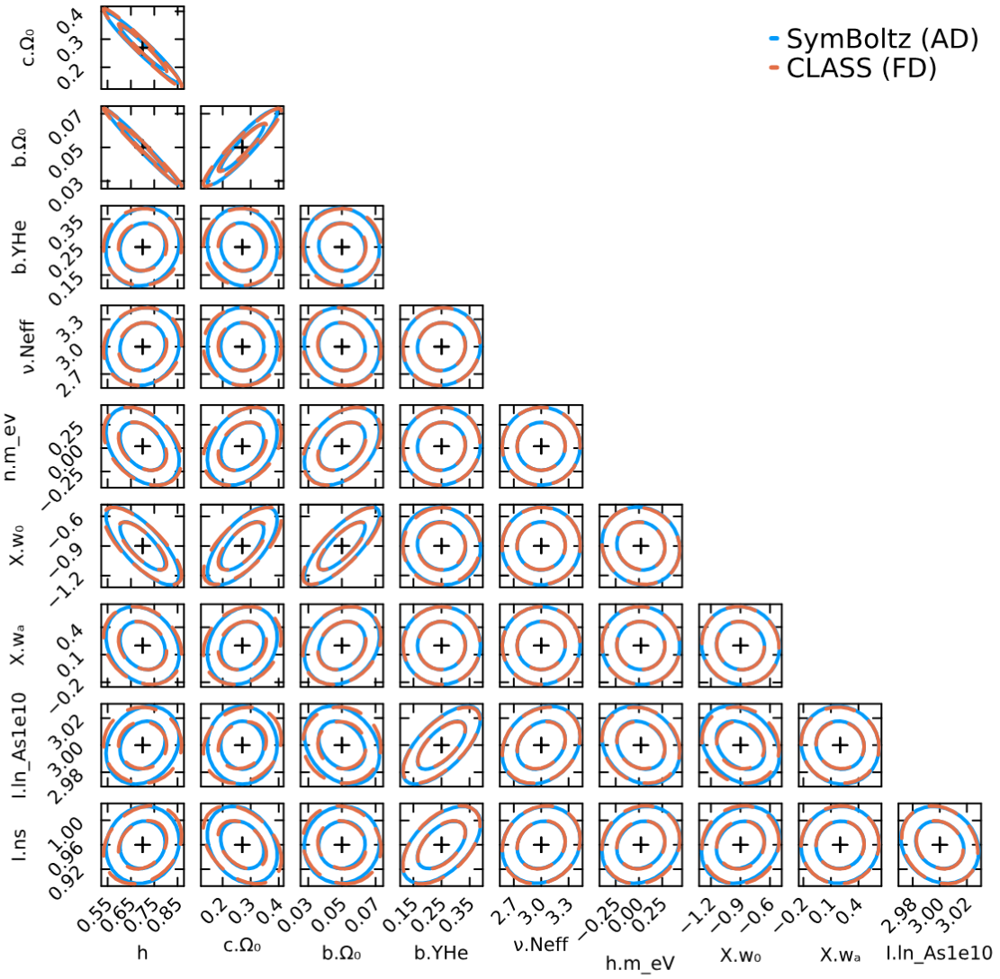{height=2.7cm}

:::
::: {.column width=30%}

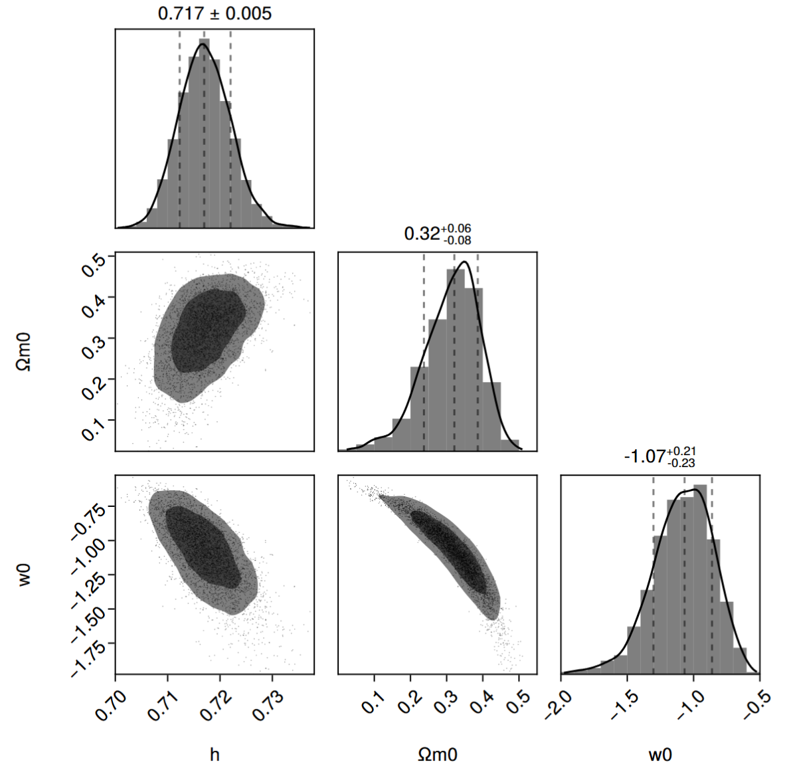{height=2.7cm}

:::
::::::

 

- But slower than non-differentiable runs. Hope to improve this.

# The end

```{=latex}
\begin{center}
```
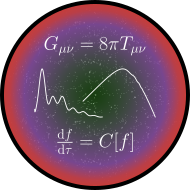{height=3cm} \hspace{1cm} {height=3cm}
```{=latex}
\end{center}
```

\vspace{0.3cm}

SymBoltz is available at [github.com/hersle/SymBoltz.jl](https://github.com/hersle/SymBoltz.jl):

- Install with `using Pkg; Pkg.add("SymBoltz")` in Julia

- Includes link to [documentation](https://hersle.github.io/SymBoltz.jl/stable) and [paper](https://arxiv.org/abs/2509.24740) {height=3%}

- Suggestions and contributions are very welcome!

- Star Github if you want to help visibility :) {height=3%}

\vspace{0.5cm}

## Thanks for listening!
